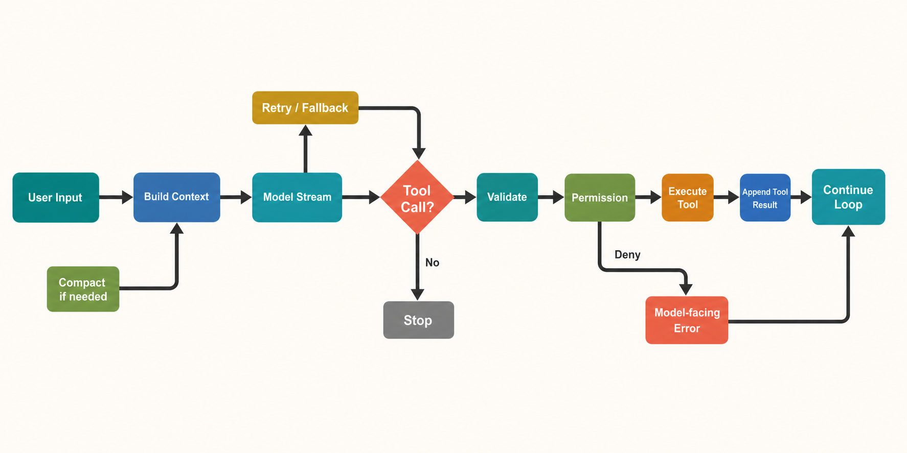

# 设计空间与静态 Running Example

> **证据边界。** 本报告分析 source-only commit `16a676f`。其 1,884 个 TS/TSX 文件、关键 symbol 与 feature gates 和论文所述 Claude Code v2.1.88 corpus 强指纹一致，但缺少 package version、上游 tree hash、build manifest，不能视为已证明的 exact 官方 artifact。快照仍有 657 个无法解析的相对 import；除 SiFlow 协议探针外，主循环、安全、session 与 subagent 结论均为 static-only。官方材料只支持产品立场，五价值/十三原则是 analyst synthesis。[X: X-001–X-003] [D: D-001–D-008] [C: C-001, C-024–C-026] 首次遇到缩写或内部名词时，可查 [全局术语表](16-glossary.md)。

## 六个设计问题

这一节先解释每个问题的两个端点，再说明 Claude Code 快照实际落在哪里。最后的表格只是速查摘要；第一次阅读时应先看六个小节。

### 1. 界面与 loop 是一套系统，还是每个界面各有一套？

这里的 **界面（surface）** 指用户或外部程序进入 harness 的方式，例如交互式 REPL、`--print`、SDK、server 或 bridge；**core loop** 指把 messages 发给模型、处理 `tool_use`、执行工具、回填 `tool_result` 并判断停止的控制器。

一种设计是“每个界面拥有独立 controller”：REPL 有自己的循环，SDK 另写一套，server 再写一套。优点是每个入口可以高度定制；缺点是 stop condition、tool error 和 permission 语义容易随时间漂移。该快照选择“薄适配器 + 共享 `query()`”：REPL 的 QueryGuard 和 headless QueryEngine 分别准备 UI state、structured I/O、context 与 tools，随后消费同一个 async generator。[S: S-004–S-006] [C: C-002–C-004]

“共享 loop”不等于所有入口行为相同。交互入口能显示 approval dialog、接收 ESC 和增量渲染；headless 入口必须用非交互策略表达同一决定。因此共享的是模型/工具状态机，不是整个产品体验。

### 2. Context 是每轮完整快照，还是按生命周期合流的流水线？

**快照式 context** 可以理解为：每次模型请求前，从一个 canonical state 重新收集所有规则、memory、history 和工具说明，拼成一份完整且自包含的 prompt。它的优点是单次 request 容易解释；代价是重复加载大量不变内容，也不容易利用 lazy loading 或 provider cache。

**流水线式 context** 则把信息按“什么时候产生、要保留多久、何时才需要”分开。Claude Code 更接近流水线：

- **startup**：session 建立或 reload 时准备的基础信息，例如 system prompt、初始工具/mode guidance、启动时发现的 CLAUDE.md；它不是每个 token chunk 都重新发现一次。
- **lazy**：先只保留可发现性，真正需要时再加载的内容，例如进入某目录后适用的 instructions、被选择的 skill、后来连接的 MCP/agent/tool delta。`lazy` 说的是加载时机，不表示内容不重要。
- **per-turn**：只与当前用户提交或当前 iteration 有关的信息，例如本轮输入、queued messages、diagnostics、task/agent notification 和刚完成的 tool result。
- **carry-forward**：已经进入当前 message chain，并自然随下一次 model request 继续携带的 user/assistant/tool blocks。它描述“在这次 live conversation 中继续带着走”。
- **durable**：写到进程外持久介质、重启后仍可能恢复的信息，例如 transcript JSONL、CLAUDE.md 和部分 memory。durable 描述存储寿命，不保证下一轮一定进入模型。

这些维度可以重叠：一条 tool result 先是 per-turn，写入 message chain 后成为 carry-forward，若 transcript flush 成功还会成为 durable history。一次具体请求大致经历“startup baseline + 当前 history projection + lazy delta + per-turn attachment → token/compaction 变换 → model request”。这种设计减少无关 context 和重复成本，却让 provenance（每段信息来自哪里）、顺序和 compaction survivor 更难理解。[S: S-010–S-015] [C: C-006–C-007]

### 3. Tool registry 是否就等于模型这一轮能调用的工具？

**Registry** 只是“harness 已经知道哪些 capability”的集合。一个工具从代码存在到真正产生副作用，至少经过：安装/配置 → 注册进候选池 → 按 mode/feature/deny 过滤 → 转成这一轮模型可见 schema → 模型实际发出 `tool_use` → router 查找并验证 → permission 决定 → 可选 sandbox → 执行。

因此 `registered`、`visible`、`requested`、`authorized` 和 `executed` 是不同状态。例如 MCP server 已连接并不保证其所有 tools 都暴露；skill 被发现不等于它是 executable tool；模型看见 Bash schema 也不表示当前命令会被允许。[S: S-019–S-022] [C: C-010–C-011]

替代方案是固定一组工具并每轮全部发送，分析更简单，但 schema token 成本高，也无法自然表达 plugin、MCP、mode 与 deferred discovery。当前分层机制更灵活，代价是安全审计不能只看 registry。

### 4. Approval 与 isolation 是同一件事吗？

**Approval/permission** 回答“这项动作在当前规则和 mode 下是否允许”：结果可以是 allow、deny 或 ask。**Isolation/sandbox** 回答“如果允许，动作在怎样的文件系统、网络和进程边界内执行”。前者是政策决定，后者是执行环境约束。

四种组合都可能有意义：deny 时不应执行；allow + sandbox 表示允许但限制影响范围；allow + no sandbox 表示在宿主边界直接执行；ask + sandbox 表示先取得人类决定，再以受限环境执行。Claude Code 的 canonical Bash 路径先 permission，再根据配置决定是否包 sandbox wrapper。[S: S-023–S-027] [C: C-012–C-014]

另一种系统可以强制所有动作进 sandbox、从不弹窗；也可以只依赖 approval、不提供 OS isolation。Claude Code 将两层分开，部署更灵活，但读者很容易把“用户点了允许”误读为“这条命令已经隔离”。

### 5. Child agent 到底共享什么、隔离什么？

“Subagent 有独立 context”只回答一个维度。完整边界至少包括：模型消息/context、tool pool、permission rule、transcript、workspace/files、process/backend、cancellation 和结果通道。

普通 Agent child 会重新构建 system/user context、tools、MCP 和 sidechain transcript，因此不会把 parent 的完整 message history 原样塞进去；但默认仍在同一 cwd/files 上工作。async child 有独立 abort controller，不自动随主请求 ESC 结束；显式 worktree child 才获得独立 git worktree；swarm teammate 又可能由 in-process backend 或 terminal pane 承载。[S: S-032–S-037] [C: C-017–C-020]

替代方案是每个 child 强制独立 process/container/worktree。那会减少文件竞争和污染，但同步 artifacts、启动成本和清理都更复杂。当前选择偏向低成本协作，把强 workspace isolation 作为显式选项。

### 6. Resume 是恢复会话，还是回滚整个世界？

**Resume** 恢复的是 conversational/session state：根据 JSONL、`parentUuid` 和 metadata 重建 messages、session identity、部分 agent/worktree/todo 状态。**Rollback** 则意味着外部世界也回到旧时刻，例如把普通 workspace 文件、已启动进程和远程副作用恢复到 checkpoint。

该快照只支持前一种语义。用户在上次 session 中写过的文件通常仍留在 cwd；resume 不会自动撤销。`--fork-session` 创建新的 session identity 并复制可恢复 history，也不是 git branch。CLI 的 file-history rewind 是另一个显式、范围有限的机制，恰好说明 session restore 不是事务式 workspace snapshot。[S: S-029–S-031, S-044] [C: C-015–C-016, C-029]

替代设计可以把每个 turn 放在 **copy-on-write workspace**（未修改数据共享底层副本，首次写入时才创建私有副本）或 **VM checkpoint**（保存虚拟机磁盘/内存状态）中，实现会话与文件一起回退；代价是存储、外部服务一致性和长期 CLI 工作流都会更复杂。

## 六个问题速查

| 问题 | Claude Code 的选择 | 主要替代方案 | 权衡与边界 | 证据 |
|---|---|---|---|---|
| 多入口如何复用 core | Surface 先各自适配 UI、structured I/O、permission callback 和 live state，再共用 `query()`。 | 每个入口维护独立 controller，各自实现 tool loop、stop 和 recovery。 | 共享 core 降低语义漂移；代价是 REPL/headless 的 state、approval 和输出差异必须靠 adapter 处理，不能假设行为完全相同。 | C-002–C-004 |
| context 如何构造 | Startup、lazy、per-turn、carry-forward、durable 来源合流，再经过有序 shaping/compaction。 | 每轮从 canonical store 重建一份完整 prompt snapshot。 | 节省 token 和重复加载，但 provenance、stage 顺序、survivor 和摘要损失更难审计。 | C-006–C-007 |
| 工具何时可执行 | Capability 依次经历 registered、eligible、visible schema、requested、validated、authorized、executed。 | 固定工具全集每轮直接发给模型并按名称 dispatch。 | 动态 MCP/skill/plugin 能力更灵活；审计时不能只看 registry，必须说明证明到哪一级。 | C-010–C-011 |
| 是否允许与如何隔离 | Permission 先回答 allow/ask/deny；若允许，Bash 等路径再按配置选择 sandbox wrapper。 | 所有动作强制 sandbox，或完全只靠人类 approval。 | 两层可组合，部署灵活；但 allow 不等于 isolated，sandbox 也不是 rollback。 | C-012–C-014 |
| child 的隔离边界 | Child 重建 context 和 sidechain transcript；普通 child 默认共享 cwd/files，worktree 是显式隔离选项。 | 每个 child 强制独立 process、container 或 worktree。 | 协作和 artifact 共享成本低；代价是文件竞争、policy prompt owner 和 cancellation 需要逐维验证。 | C-017–C-020 |
| resume 恢复什么 | 从 JSONL、parentUuid 和 metadata 恢复会话 view，不回滚普通 workspace 文件，也不恢复临时 grants。 | 为每个 turn 建立事务式 workspace checkpoint 或 VM snapshot。 | 符合 CLI 长任务习惯、存储成本低；不能当作撤销或安全回滚机制。 | C-015–C-016 |

收益、代价和替代方案均是分析者综合，不是作者动机。[D: D-001–D-008] [I: I-003, I-005] [C: C-024, C-027]

## 静态 running example：一次需要工具的用户提交

*读者图问题：一次用户 query 如何跨多个 model request 与 tool call 迭代？ 这是 gpt-image-2 读者插图；当前实现边均为 static-only，结构化证据与排除项见 [图片元数据](../diagrams/generated/metadata.json)。*

1. REPL 的 **QueryGuard** 先取得当前主 query 的执行权，防止两个主 query 同时修改 live state；headless 模式则由 **QueryEngine** 建立等价的 structured I/O 上下文。两者最终调用共享 `query()`。[S: S-004–S-006]
2. `queryLoop` 先投影当前 message chain，处理 tool-result budget、可选 snip/microcompact/collapse/autocompact 和 hard limit，再构造一次 Anthropic Messages request。[S: S-007, S-014]
3. 模型 streaming response 中若出现 `tool_use` block，router 用 tool name 查找当前 pool，验证 schema/input，运行 pre-tool hook，再请求 permission decision。[S: S-022–S-024]
4. 允许后，Bash 等工具可能先套 sandbox wrapper，再由 Shell spawn；拒绝或验证失败时不会静默丢弃，而是生成模型可消费的 error `tool_result`。[S: S-025–S-027]
5. `tool_result` 与 runtime attachments 被追加到 message chain，触发同一用户 query 的下一次 iteration。没有 tool call、达到 max turns、hook stop、abort 或不可恢复错误时，`query()` 才到 terminal transition。[S: S-008–S-009]

**Model Stream** 是一次 API request 的流式返回；**Continue Loop** 是同一用户提交中的下一次 agentic iteration；**Stop** 是当前 `query()` 的终态；**Session** 则可以横跨多个用户提交。这个例子是源码路径演练，不是 runtime trace。[技术证据图](../diagrams/turn-flow.svg)

不能由此推出：external bundle 包含所有 feature path、真实模型一定选择某工具、permission denied 的 OS 层绝无副作用，或该路径在生产中的出现频率。
