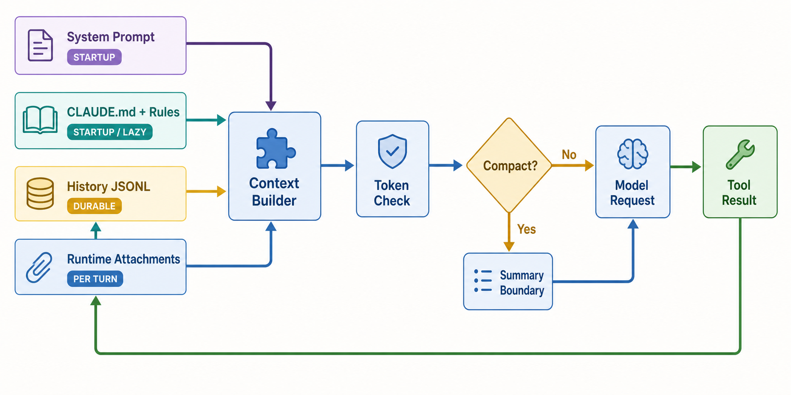

# Context、Memory 与 Compaction

> **证据边界。** 本报告分析 source-only commit `16a676f`。其 1,884 个 TS/TSX 文件、关键 symbol 与 feature gates 和论文所述 Claude Code v2.1.88 corpus 强指纹一致，但缺少 package version、上游 tree hash、build manifest，不能视为已证明的 exact 官方 artifact。快照仍有 657 个无法解析的相对 import；除 SiFlow 协议探针外，主循环、安全、session 与 subagent 结论均为 static-only。官方材料只支持产品立场，五价值/十三原则是 analyst synthesis。[X: X-001–X-003] [D: D-001–D-008] [C: C-001, C-024–C-026]

*读者图问题：哪些信息在什么时机进入模型，又经过哪些变换？ 这是 gpt-image-2 读者插图；当前实现边均为 static-only，结构化证据与排除项见 [图片元数据](../diagrams/generated/metadata.json)。*

| 图中标签 | 生命周期 | 典型内容 |
|---|---|---|
| System Prompt | startup/reload，部分 section 动态重算 | tone、task policy、tool/mode guidance |
| CLAUDE.md + Rules | startup/lazy | managed/user/project/local、rules、add-dir |
| History JSONL | durable/carry-forward | user/assistant/tool chain、compact boundary |
| Runtime Attachments | per-turn | MCP/agent delta、skills、memory、tasks、diagnostics、queue |

[claudemd.ts](https://github.com/IcyFeather233/claude-code/blob/16a676ffa36eadbfb28eec39007dff73941346b1/src/utils/claudemd.ts#L1) 保留来源 provenance，并处理多层目录、@include 和外部 include approval；[attachments.ts](https://github.com/IcyFeather233/claude-code/blob/16a676ffa36eadbfb28eec39007dff73941346b1/src/utils/attachments.ts#L1) 区分 user-triggered、every-thread 与 main-only attachment。[S: S-012–S-013]

## Context 是有结构的位置，不只是字符串拼接

System prompt/context 放产品约束、tool/mode guidance 与稳定环境信息；user context 则把 CLAUDE.md、memory、skills、MCP/agent/tool delta 和 runtime attachments 以可追踪来源带入消息链。`CLAUDE.md` 还分 managed、user、project、local 与目录层级，可通过 `@include` 引入外部文件；auto memory 是可审计文件，不等于 transcript。[D: D-005–D-006] [S: S-010–S-013]

## Compaction 不是一个摘要按钮

| 实际顺序 | Stage | 条件 | 主要效果 |
|---|---|---|---|
| 1 | Tool-result budget | 常规路径 | 压低旧工具结果占用，不先改写完整对话 |
| 2 | History snip | `HISTORY_SNIP` | 投影掉满足条件的历史段 |
| 3 | Microcompact | 常规路径；cache 另受 feature 控制 | 更细粒度清理旧内容/结果 |
| 4 | Context collapse | `CONTEXT_COLLAPSE` | 条件性折叠更大历史结构 |
| 5 | Autocompact | threshold/config | 生成 summary boundary 并重注入必要状态 |
| 6 | Hard-limit recovery | 前述不足时 | prompt-too-long/max-output 的恢复或终止 |

这个顺序直接来自 [query.ts ordered shapers](https://github.com/IcyFeather233/claude-code/blob/16a676ffa36eadbfb28eec39007dff73941346b1/src/query.ts#L365)；早先报告把 microcompact 与 history snip 颠倒，已由逐语句 source-order audit 纠正。[S: S-014] [C: C-007]

`compactConversation` 通过另一次模型调用生成 summary boundary，再有限重注入近期文件、plan、skill、MCP/agent/tool delta。[S: S-015] 这些机制分别可能清理旧结果、投影历史段，或用摘要替换历史。Memory 与 transcript 都会进入 context，但前者是可维护知识来源，后者是 durable execution history；所有权和恢复语义不同。[S: S-012–S-015, S-029]

最大未知项是摘要信息损失、实际 threshold、启用的 feature projection 和长任务语义漂移。需要可运行构建强制 overflow，再比较压缩前后 request envelope 与 resume。[技术证据图](../diagrams/context-lifecycle.svg)
