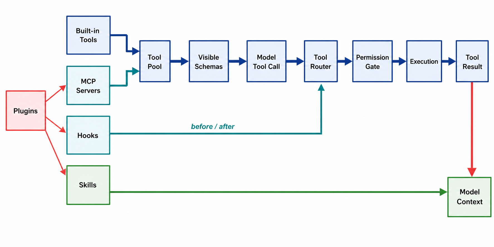

# 模型、工具与扩展

> **证据边界。** 本报告分析 source-only commit `16a676f`。其 1,884 个 TS/TSX 文件、关键 symbol 与 feature gates 和论文所述 Claude Code v2.1.88 corpus 强指纹一致，但缺少 package version、上游 tree hash、build manifest，不能视为已证明的 exact 官方 artifact。快照仍有 657 个无法解析的相对 import；除 SiFlow 协议探针外，主循环、安全、session 与 subagent 结论均为 static-only。官方材料只支持产品立场，五价值/十三原则是 analyst synthesis。[X: X-001–X-003] [D: D-001–D-008] [C: C-001, C-024–C-026]

*读者图问题：能力如何变成模型可见 schema，再变成可执行 action？ 这是 gpt-image-2 读者插图；当前实现边均为 static-only，结构化证据与排除项见 [图片元数据](../diagrams/generated/metadata.json)。*

## 图中层次

- **Built-in Tools**：Bash、Read/Edit/Write、search、Agent、Task、plan 等；进入 pool 仍受 mode、feature、deny 和 enabled state 影响。[S: S-019]
- **MCP Servers**：运行时外部 capability provider；连接 lifecycle 与一次 tool invocation 不是同一步。[S: S-020]
- **Plugins**：是 packaging/distribution 层，不是单一 runtime injection point。manifest 除 metadata 外可组合 hooks、commands、agents、skills、output styles、channels、MCP、LSP、settings 与 user config 十类 component surfaces。[S: S-046]
- **Skills**：主要把 prompt/workflow 内容按需注入 context，不天然构成 executable sandbox；其低初始 context cost 来自 progressive disclosure，而不是“免费”。[D: D-005] [S: S-013, S-033]
- **Tool Pool**：当前候选集合；built-in 在同名冲突时优先，并稳定排序。[S: S-020]
- **Visible Schemas**：真正发送给模型的 schemas。registry 存在不保证这一轮可见。[S: S-019–S-021]
- **Tool Router**：lookup、schema/input validation、hooks 和 permission 的共同执行路径。[S: S-022]
- **Tool Result**：映射为模型可消费内容；过大结果可能落盘，只返回 preview/path。

## Provider 与 retry

[getAnthropicClient](https://github.com/IcyFeather233/claude-code/blob/16a676ffa36eadbfb28eec39007dff73941346b1/src/services/api/client.ts#L88) 选择 direct Anthropic、Bedrock、Vertex 或 Foundry。[Messages request builder](https://github.com/IcyFeather233/claude-code/blob/16a676ffa36eadbfb28eec39007dff73941346b1/src/services/api/claude.ts#L1480) 负责 messages/system/tools、thinking、cache/beta headers 与 stream；[withRetry](https://github.com/IcyFeather233/claude-code/blob/16a676ffa36eadbfb28eec39007dff73941346b1/src/services/api/withRetry.ts#L170) 处理 auth refresh、429/529、backoff、fallback 和 token correction。[S: S-016–S-018]

## SiFlow 结果

models route 返回 qwen3.6-35ba3b 与 262,144 context；Anthropic /v1/messages 非流式和 SSE 均 HTTP 200；带 tool_choice=echo 与 enable_thinking=false 时返回 tool_use，input 为 {"text":"hello"}。[X: X-002]

这证明协议子集可用，不证明完整 Claude Code request 兼容。真实 envelope 还含 beta headers、thinking/output config、prompt caching、复杂 schemas 与多轮 tool_result。[C: C-009, C-025]

六个不要混淆的等号：installed plugin ≠ enabled plugin；registered tool ≠ visible schema；visible ≠ model 一定调用；tool call ≠ permission allow；allow ≠ sandbox enabled；skill loaded ≠ 独立进程执行。[技术证据图](../diagrams/tool-extension-surface.svg)

## 四类扩展注入的是不同语义位置

> **读者图待生成。** 问题：MCP、Plugins、Skills、Hooks 分别注入 loop 的哪个语义位置？ evidence-grounded story spec 与 gpt-image-2 prompt 已生成；外部图像 API 尚未获本轮风险授权，因此当前不嵌入占位图或技术 SVG。

| 机制 | 主要注入点 | 模型/loop 实际得到什么 | Context 成本与治理 |
|---|---|---|---|
| Skills | Assemble | 描述先可发现，命中后再加载详细 instruction/resource | 初始低、使用后增长；内容指导不等于权限 |
| MCP Servers | Model surface + execute | 动态 tool schemas/resources/prompts，调用时走 MCP client lifecycle | schema 常驻或按需暴露；实际 tool call 仍需治理 |
| Hooks | Assemble、authorize/execute、lifecycle | 27 个 event 的观察、修改、阻断或外部命令回调 | event-driven；并非每个 hook 都进入 model context |
| Plugins | Packaging fan-out | 把上述机制及 commands/agents/LSP 等一起分发和配置 | 自身没有一种统一 context 或 execution 语义 |

这张图按“模型看见什么、模型能调用什么、动作能否/如何执行”分层，而不是按目录或安装格式分组。27 是当前 `HOOK_EVENTS` 常量的源码计数；十类是 manifest component groups，均受 snapshot/feature/config 条件限制，不能外推成所有生产构建始终启用。[S: S-043, S-046] [C: C-028]
