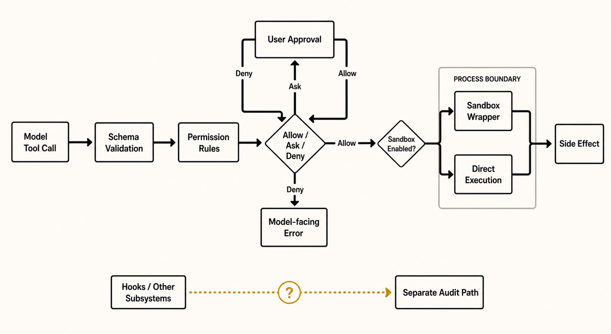

# 权限、Sandbox 与 Workspace

> **证据边界。** 本报告分析 source-only commit `16a676f`。其 1,884 个 TS/TSX 文件、关键 symbol 与 feature gates 和论文所述 Claude Code v2.1.88 corpus 强指纹一致，但缺少 package version、上游 tree hash、build manifest，不能视为已证明的 exact 官方 artifact。快照仍有 657 个无法解析的相对 import；除 SiFlow 协议探针外，主循环、安全、session 与 subagent 结论均为 static-only。官方材料只支持产品立场，五价值/十三原则是 analyst synthesis。[X: X-001–X-003] [D: D-001–D-008] [C: C-001, C-024–C-026] 首次遇到缩写或内部名词时，可查 [全局术语表](16-glossary.md)。

*读者图问题：工具造成副作用之前经过哪些判断与边界？ 这是 gpt-image-2 读者插图；当前实现边均为 static-only，结构化证据与排除项见 [图片元数据](../diagrams/generated/metadata.json)。*

共享 toolExecution 先做 schema/tool validation，再运行 pre-tool hooks，随后 permission resolver。[hasPermissions](https://github.com/IcyFeather233/claude-code/blob/16a676ffa36eadbfb28eec39007dff73941346b1/src/utils/permissions/permissions.ts#L560) 综合 blanket deny、ask rules、tool check、tool deny、interaction requirement、safety、mode、allow rule 与 passthrough。[S: S-022–S-024]

## Permission 由 rule、mode、decision 和 prompt 四部分组成

- **Rule** 针对 tool name 和可选 input pattern 表达 allow、ask 或 deny，并记录来源，例如 managed policy、user/project/local settings、CLI 或当前 session。deny-first 表示更强的拒绝规则不会被较宽松 allow 轻易覆盖。
- **Mode** 是一组默认决策策略，不是单条权限。例如 `plan` 限制实现型动作，`dontAsk` 在无法交互时倾向 fail closed。mode 仍会与具体 rules 和 tool-specific safety check 组合。
- **Decision** 是对“这一次具体 tool input”算出的结果：allow、deny，或需要 ask。它不是对整个 tool 永久授权。
- **Prompt/approval UI** 只在当前 surface 能与人交互且 decision 为 ask 时出现。headless/async child 不能假设可以弹出和 REPL 相同的 dialog。

**Blanket deny** 是覆盖范围较广的拒绝；**managed policy** 是组织/管理员施加、普通 session 不能随意覆盖的规则；**interaction requirement** 表示某些 action 无论一般 mode 多宽松，仍要求显式人类交互；**classifier** 是 feature-gated auto mode 中辅助判断具体请求风险的模型化步骤，不等于 sandbox。**Fail closed** 指无法完成必要判断或无法询问时选择拒绝/停止，而不是默认放行。

外部 schema 固定五种 mode：`default`、`acceptEdits`、`dontAsk`、`plan`、`bypassPermissions`。`auto` 只有 `TRANSCRIPT_CLASSIFIER` 构建中才加入 user-addressable runtime set，并对 external serialization 映射回 `default`；`bubble` 只属于 internal union，不在 runtime validation set。论文或图把它们直接数成七个并列用户模式会夸大可用表面。[S: S-023, S-044]

| Mode | 实际语义 | 不能误读为 | 计数边界 |
|---|---|---|---|
| default | 按规则、tool safety check 和交互可用性决定 allow/ask/deny；需要人类判断时可弹 approval。 | 所有工具都必然弹窗，或所有未知动作都可自动执行。 | external schema 中的稳定用户模式。 |
| acceptEdits | 对编辑类动作给更宽松默认，但 shell、网络、敏感 tool 仍受 rules、mode 和 safety checks 约束。 | 全部 tool 直接 allow，或关闭 permission resolver。 | external schema 中的稳定用户模式。 |
| dontAsk | 在无法或不应交互时避免弹窗；不能自动决定的路径通常 fail closed 或按非交互策略处理。 | `bypassPermissions` 的别名，或静默允许所有 ask。 | external schema 中的稳定用户模式。 |
| plan | 偏向规划/阅读，限制实现型或高副作用动作。 | OS 层 read-only sandbox；它是 permission mode，不是 filesystem 隔离机制。 | external schema 中的稳定用户模式。 |
| bypassPermissions | 显式绕过 canonical permission decision，让工具路径减少或跳过 ask/deny 检查。 | 环境绝对安全，或 sandbox 自动开启。 | external schema 中的稳定用户模式，但应视为高风险配置。 |
| feature-gated auto | `TRANSCRIPT_CLASSIFIER` 构建中加入的自动分类路径，结合 classifier 与特殊 safety handling。 | external schema 的第六个无条件稳定 mode。 | feature/build 条件满足时才 user-addressable，serialization 还会映射回 `default`。 |
| internal bubble | child/dialog 之间传播 permission prompt 或 decision 语义的内部 union 值。 | 用户可在 CLI/settings 中直接选择的 runtime mode。 | internal-only，不计入外部用户 mode census。 |

## 七个重叠边界，而不是一个 PermissionGate

1. tool-specific input/schema 与 dangerous-pattern prefilter；
2. managed/user/project/local/CLI/session rules，deny 优先；
3. mode fallback 与交互可用性；
4. feature-gated auto classifier 和 explicit-user-permission exceptions；
5. 27-event hooks 中的 PermissionRequest/Denied、Pre/PostToolUse；
6. 可选 filesystem/network sandbox；
7. resume/fork 重新从持久 settings/CLI 初始化，**不恢复 session-scoped allow/deny/ask grants**。[D: D-001, D-003–D-004] [S: S-023–S-028, S-043–S-044]

第 7 层是 trust freshness，而不是 transcript 丢失：会话历史可恢复，临时授权不会随 JSONL 被静默带入新进程。[C: C-029]

## Sandbox 是后续执行变换

shouldUseSandbox 依赖 availability/settings、excluded commands 与 dangerouslyDisableSandbox 是否被 policy 允许。选中后 SandboxManager 映射 FS/network settings，Shell 包装命令再 spawn；未选中则直接由 Shell 执行，但 canonical path 中仍应先经过 permission。[S: S-025–S-027]

所以 Permission 回答“可不可以”，Sandbox 回答“以什么边界执行”。普通 Agent child 默认共享 cwd/files；worktree isolation 是可选项。Sandbox 也不是事务式文件回滚。[S: S-032, S-035]

图底部 Hooks + Other Subsystems 带 AUDIT，因为 startup、hooks、MCP lifecycle、bridge/daemon 等有独立副作用表面。不能因为 canonical tool path 有 PermissionGate 就自动宣称全部同等受控。这是 open claim C-014，不是已经发现具体 bypass。[S: S-003, S-028] [I: I-001]

下一实验应抓 harness event、process tree、filesystem diff 与 network attempts，对 permission modes、sandbox on/off、hooks/MCP 做矩阵。[技术证据图](../diagrams/permission-pipeline.svg)
