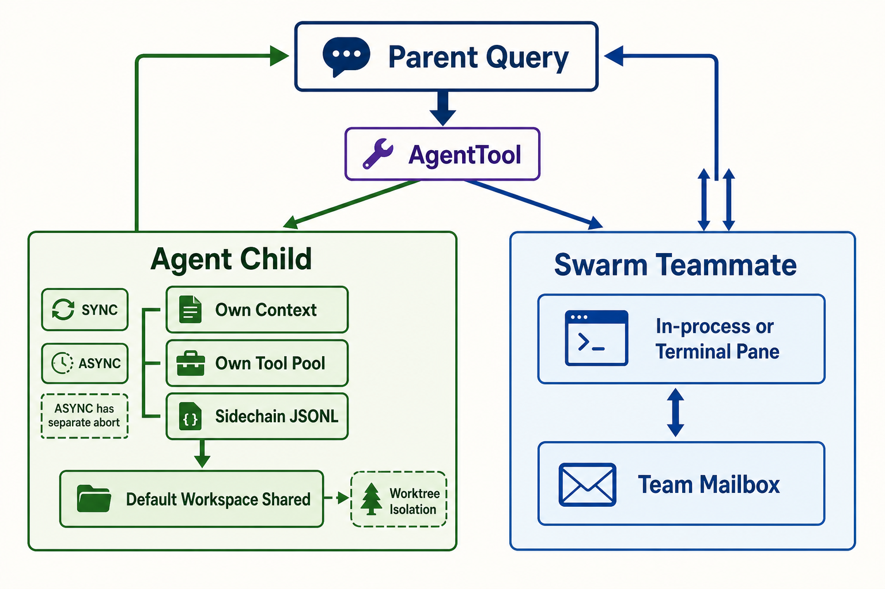

# Subagent 与团队协作

> **证据边界。** 本报告分析 source-only commit `16a676f`。其 1,884 个 TS/TSX 文件、关键 symbol 与 feature gates 和论文所述 Claude Code v2.1.88 corpus 强指纹一致，但缺少 package version、上游 tree hash、build manifest，不能视为已证明的 exact 官方 artifact。快照仍有 657 个无法解析的相对 import；除 SiFlow 协议探针外，主循环、安全、session 与 subagent 结论均为 static-only。官方材料只支持产品立场，五价值/十三原则是 analyst synthesis。[X: X-001–X-003] [D: D-001–D-008] [C: C-001, C-024–C-026] 首次遇到缩写或内部名词时，可查 [全局术语表](16-glossary.md)。

*读者图问题：有哪些 child 机制，它们分别隔离或共享什么？ 这是 gpt-image-2 读者插图；当前实现边均为 static-only，结构化证据与排除项见 [图片元数据](../diagrams/generated/metadata.json)。*

## 先定义图中名词

- **Parent Query**：主线程当前一次用户 query；它可以通过 AgentTool 委派，也可能在 child 后继续自己的 loop。
- **AgentTool**：模型可调用的 delegation tool。它选择 normal/fork、sync/async、agent definition、tool pool 与 isolation。[S: S-032]
- **Agent Child**：runAgent 驱动的 child query loop。它有自己的初始 messages、system/user/system context、tool context、agent-specific MCP 与 sidechain transcript。[S: S-033]
- **SYNC**：父 tool call 等 child 完成后返回 result；共享某些 AppState callback 和父 abort 语义。
- **ASYNC**：注册为 background task，拥有未链接到主请求 ESC 的 abort controller，完成后以 notification 回到主 context。[S: S-032–S-033]
- **Sidechain JSONL**：child 的 transcript 文件，不等于主 session JSONL 中的一条普通消息。[S: S-029, S-033]
- **Shared Workspace**：普通 Agent child 默认在同一 cwd/files 上工作；context 分开不代表文件隔离。
- **Worktree Isolation**：显式请求后创建独立 git worktree。无改动可清理，有改动通常保留路径供后续处理。[S: S-032, S-035]
- **Swarm Teammate**：团队成员机制，可由 in-process backend 或 tmux/iTerm terminal pane 承载，不应一律称为独立进程。[S: S-034, S-036]
- **Team Mailbox**：~/.claude/teams/<team>/inboxes/<name>.json，使用文件锁投递 unread messages，也承载 shutdown/plan approval protocol。[S: S-037]

本报告没有使用“V2 mailbox”这个名称，因为该快照的证据支持的是具体 Team Mailbox；给机制贴未知版本标签只会增加阅读成本。

## “隔离”必须拆成多个维度

- **Context isolation**：child 是否拥有独立 message history、system/user context 和 token budget。独立 context 不自动意味着独立文件系统。
- **Tool/policy isolation**：child 看到哪些 tools、permission mode/rules 如何从 parent 派生，以及谁负责弹 approval prompt。
- **Transcript isolation**：child 的过程是否写入独立 sidechain JSONL，parent 最终只接收 summary/result，还是两者共享同一 message chain。
- **Workspace isolation**：child 是否与 parent 使用同一 cwd/files，还是进入独立 git worktree/container。
- **Process/backend isolation**：child loop 是在同一进程、另一个 terminal pane，还是独立 worker 中执行。terminal pane 是承载方式，不等于安全 sandbox。
- **Cancellation isolation**：parent 的 ESC/abort 是否传播。`AbortController` 是 JavaScript 的取消信号对象；独立 controller 表示 child 不自动订阅 parent 的同一取消信号。
- **Result channel**：sync tool result、async task notification 和 mailbox message 的到达时机、持久性和消费方不同。

`AppState callback` 指 child 仍可能调用 parent 进程提供的状态读取/更新函数；因此“独立 context”不能简化成“所有状态完全复制”。

## 静态 inheritance matrix

| 维度 | 普通 Agent child | Async child | Worktree child | Swarm teammate |
|---|---|---|---|---|
| Model/context | 由 child 重新构建初始 messages、system/user context、tool context 和 agent-specific MCP，不直接复制 parent 完整 history。 | 也重新构建 context，但以 background task 方式运行，完成后把 notification/delta 返回主 context。 | 重新构建 context，同时把 workspace path 指向新 git worktree；context 隔离与文件隔离同时出现。 | teammate runner 维护自己的 context 和任务状态；是否与主进程共享内存取决于 backend。 |
| Tool pool / policy | 从 parent permission context 派生，再应用 agent definition、mode 和 allowedTools override；managed/CLI policy 仍应保留。 | 派生逻辑相同，但 non-interactive 语义更重要，因为不能假设父 REPL dialog 可用。 | 派生逻辑相同；worktree 只改变文件边界，不自动扩大 tool 权限。 | 由 teammate runtime、mode、team config 和 backend 决定；不能只用 parent tool list 推断。 |
| Transcript | 写入独立 sidechain JSONL，parent 通常只接收 summary/result。 | sidechain 外还可能有 task output 与 notification，供主 context 后续消费。 | sidechain 加 worktree metadata，便于恢复或保留有改动的路径。 | team task state、team files 与 mailbox 共同承载过程和消息。 |
| Workspace | 默认共享 parent cwd/files，因此两个 child 可能竞争同一文件。 | 默认同样共享 cwd/files；后台运行会放大并发写入风险。 | 使用独立 git worktree；无改动可清理，有改动通常保留路径。 | 取决于 backend 与 team 配置：可能是同进程、终端 pane 或其他 runner，不能预设 container 隔离。 |
| 主请求 ESC / cancellation | sync 路径通常与父请求 abort 语义有关，具体传播需 runtime 验证。 | 不自动跟随主请求 ESC；需要显式 task kill/abort。 | 取决于该 worktree child 是 sync 还是 async 承载。 | 有独立 controller，可单独 abort；mailbox 仍可能保留未读消息。 |
| Result channel | 以 AgentTool 的 tool result 返回 parent loop。 | 以 task notification 或后续 attachment 进入主 context。 | 返回 result，并可能附带 retained worktree path 供后续处理。 | 通过 mailbox、task notification 或 team attachment 到达；时序与持久性不同。 |

该表是源码恢复，不是 runtime measurement；最关键的未验证项是 permission prompt 在 sync/async/teammate 间的实际传播、并发文件冲突和 process identity。[C: C-017–C-020]

## Child 权限不是简单“继承父权限”

`runAgent` 从当前 parent permission context 出发，再应用 agent definition override：parent 的显式 mode 约束优先；SDK `cliArg` rules 会保留；若 child 明确声明 `allowedTools`，它替换的是 session-sourced rules，而不是抹掉 managed/CLI policy。async child 因不能弹普通父 UI dialog，还要走 non-interactive/notification 语义；`bubble` 是内部传播标记，不是用户选择的独立安全模式。[S: S-045]

因此正文使用“derive + override”而不是“copy”。要验证真实边界，必须分别记录 parent/child 的 effective mode、rule provenance、prompt owner 与最终 decision；只比较 tool list 不够。

## Coordinator 不是新的 agent loop

Coordinator mode 主要改变主模型 prompt、可见 tools 与 worker orchestration 规则；worker 最终仍通过 AgentTool/runAgent 进入共享 query core。不要把“orchestrator role”误画成与 query loop 平行的第二套 runtime。[S: S-032–S-033]

图中的 Result / Notification 是统一读者概念：sync child 返回 tool result；async child 产生 task notification；teammate 可通过 mailbox/attachment 通知。三者来源不同，报告不会用一根箭头掩盖差异。[技术证据图](../diagrams/subagent-topology.svg)
