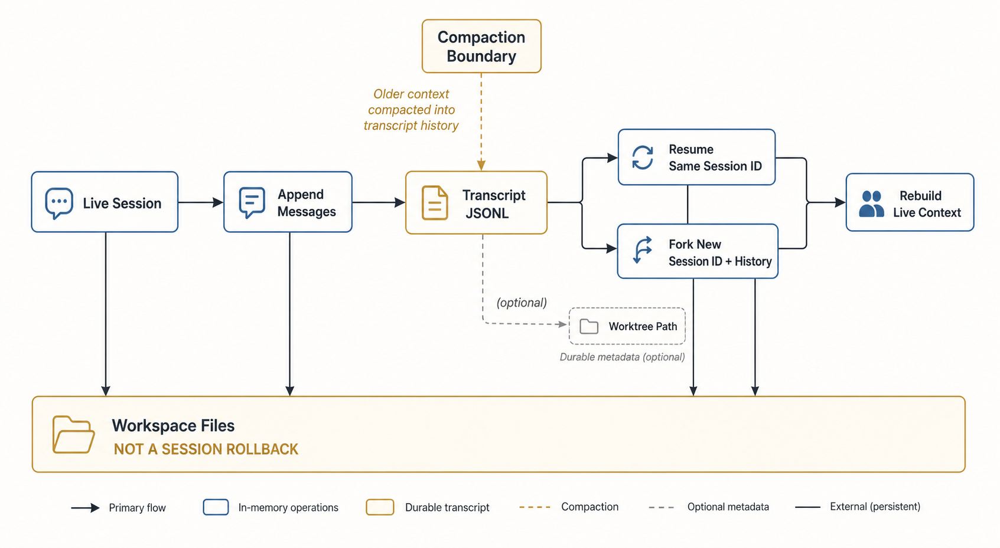

# Session、持久化与恢复

> **证据边界。** 本报告分析 source-only commit `16a676f`。其 1,884 个 TS/TSX 文件、关键 symbol 与 feature gates 和论文所述 Claude Code v2.1.88 corpus 强指纹一致，但缺少 package version、上游 tree hash、build manifest，不能视为已证明的 exact 官方 artifact。快照仍有 657 个无法解析的相对 import；除 SiFlow 协议探针外，主循环、安全、session 与 subagent 结论均为 static-only。官方材料只支持产品立场，五价值/十三原则是 analyst synthesis。[X: X-001–X-003] [D: D-001–D-008] [C: C-001, C-024–C-026] 首次遇到缩写或内部名词时，可查 [全局术语表](16-glossary.md)。

*读者图问题：哪些状态 durable，resume/fork 实际恢复什么？ 这是 gpt-image-2 读者插图；当前实现边均为 static-only，结构化证据与排除项见 [图片元数据](../diagrams/generated/metadata.json)。*

## 持久化词典

- **Live state**：只存在于当前进程内存中的 AppState、正在运行的 query、abort controller 和未 flush 队列；进程退出后必须重建。
- **Durable state**：已经写入文件等进程外介质，重启后仍可读取。durable 只表示“数据还在”，不保证格式完整、仍被当前配置采用，或自动进入模型 context。
- **JSONL transcript**：一行一个 JSON record 的追加式会话日志。它不是一份每次覆盖的完整 session JSON snapshot。
- **parentUuid**：把一条 message/record 指向逻辑父记录的标识。恢复时沿这些链接重建当前分支，而不是假设文件行号就是唯一对话顺序。
- **Sidechain**：subagent 的独立 transcript 分支。它和主 session 有关联 metadata，但 child 的中间消息不需要全部进入 parent context。
- **Queue/flush**：写入先进入进程内队列，`flush` 才表示尽力把待写 records 落到持久介质；突然 SIGKILL 可能发生在两者之间。
- **External workspace state**：普通文件、git worktree 和远程副作用虽然也会持久存在，但不由 session JSONL 统一拥有，所以 resume 不能把它们当会话字段回滚。

## Live 与 durable state

| 状态 | 所有者 | 是否 durable | 恢复含义 |
|---|---|---|---|
| Live Session | 当前进程的 AppState、正在运行的 query、队列和 abort controller。 | 否；进程退出后内存对象消失。 | Resume 只能重新构建等价 view，不能恢复正在运行的 promise、未 flush 队列或旧 controller。 |
| Message chain | transcript JSONL 与 parentUuid 逻辑链。 | 是；以追加式 records 保存。 | 通过 parentUuid、branch selection 和 compaction boundary 重建当前会话视图，不是按文件行号简单 replay 全部记录。 |
| Child transcript | subagents/agent-*.jsonl 与 agent metadata。 | 是；child 过程有独立 sidechain。 | 恢复时可选择/关联 child 分支，但 parent 不会自动把 child 中间消息全塞回主 context。 |
| Compaction boundary | transcript entry、summary segment 和 preserved metadata。 | 是；影响后续 projection。 | 指定旧历史由 summary 代表的位置，以及哪些 survivor 被重新注入。 |
| Team inbox | `~/.claude/teams` 下的 team files/mailbox。 | 是；文件锁保护 unread messages。 | 未读消息可跨进程作为 attachment 消费，但它是 team 通道，不是主 JSONL 的普通行。 |
| Workspace files | 当前 cwd、git worktree、外部命令产生的文件和远程副作用。 | 外部持久状态；由 OS/git/远端拥有。 | 不随 session resume 自动回滚；需要 git、file-history rewind 或更强 checkpoint 机制单独处理。 |
| Worktree path metadata | session/agent metadata 中记录的路径和 agent/worktree 关联。 | 条件 durable；只有路径仍存在且配置可访问时有意义。 | 可帮助恢复 child cwd 或保留改动路径，但不能保证 worktree 内容完整或无外部修改。 |

[sessionStorage](https://github.com/IcyFeather233/claude-code/blob/16a676ffa36eadbfb28eec39007dff73941346b1/src/utils/sessionStorage.ts#L500) 使用项目路径派生目录和 sessionId JSONL，主消息与 sidechain 分开；parentUuid 形成逻辑链。写入有 queue/flush，compact/snip 后会重连 dangling parent 或重写可恢复 segment。[S: S-029]

## Resume 与 fork 的精确差别

- **Resume**：默认继续原 sessionId，加载 transcript/metadata，恢复 agent/mode、file history attribution、todo、worktree path 等可用信息。
- **Fork**：保留启动时的新 sessionId，同时复制可恢复 history 与部分 replacement metadata；它是会话身份分叉，不是 git branch 或文件快照。
- **Rewind files**：CLI 另有显式 file-history rewind，说明普通 resume/fork 本身不等于 filesystem rollback；它也不是任意 workspace/process 的通用 checkpoint。[S: S-030–S-031]
- **Permission freshness**：resume/fork 不从 transcript 反序列化旧 session 的临时 allow/deny/ask grants；新进程从当前 settings 与 CLI 参数重建 permission context。[S: S-044] [C: C-029]

所以 durable transcript 保存“发生过什么”，不自动保存“现在仍被授权做什么”。若恢复后再次请求同一 Bash action，正确的验证实验是观察是否重新 ask，而不是只检查 mode label。

## Compaction 与 persistence

Compact summary 不只是内存中替换 messages：boundary、preserved segment 和重注入 metadata 会影响之后 JSONL chain 如何加载。[S: S-015, S-029]

这里的 **byte-level prefilter** 是先用字节/记录级条件筛掉明显无关或不完整的输入，避免所有内容都进入高层解析；**dead-branch pruning** 是去掉不在当前 parentUuid 分支上的历史；**parent-chain reconstruction** 是沿父链接恢复当前有效消息链。三者说明 resume 不是“按文件顺序读取所有 JSON 行”，而是从 append log 重建一个逻辑会话视图。

## Crash/exit recovery

Graceful shutdown 把 cleanup/persistence 放在 SessionEnd hooks 和 analytics 之前，并用 2 秒 cleanup race、hook budget、analytics 500ms cap 与最终 failsafe 限制退出时间。[S: S-041]

静态代码尚不能回答 corrupted JSONL 是 fail closed、局部修复还是丢弃到什么粒度，也不能证明 abrupt SIGKILL 时最后一批 buffered writes 的边界。需要 resume/fork/corruption/signal 四组实验。[技术证据图](../diagrams/persistence-lifecycle.svg)
