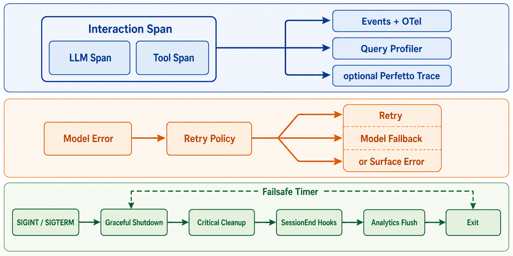

# 观测、Tracing 与评估边界

> **证据边界。** 本报告分析 source-only commit `16a676f`。其 1,884 个 TS/TSX 文件、关键 symbol 与 feature gates 和论文所述 Claude Code v2.1.88 corpus 强指纹一致，但缺少 package version、上游 tree hash、build manifest，不能视为已证明的 exact 官方 artifact。快照仍有 657 个无法解析的相对 import；除 SiFlow 协议探针外，主循环、安全、session 与 subagent 结论均为 static-only。官方材料只支持产品立场，五价值/十三原则是 analyst synthesis。[X: X-001–X-003] [D: D-001–D-008] [C: C-001, C-024–C-026]

*读者图问题：模型、工具、重试和退出如何被观测与恢复？ 这是 gpt-image-2 读者插图；当前实现边均为 static-only，结构化证据与排除项见 [图片元数据](../diagrams/generated/metadata.json)。*

## 四类观测面

| 图中标签 | 机制 | 默认/条件 | 能回答什么 |
|---|---|---|---|
| Events | analytics logEvent queue + sinks | sink 初始化、sampling/config | feature/tool/error 计数与属性 |
| OTel spans | interaction、LLM、tool、hook | enhanced/beta telemetry gate | parent-child timing、tokens、success/error |
| Query Profiler | performance marks + memory snapshot | CLAUDE_CODE_PROFILE_QUERY | context/model/tool 前后阶段耗时 |
| Perfetto Trace | Chrome trace event + agent registry | feature/user/env gated | agent hierarchy、TTFT/TTLT、tool spans |

[sessionTracing](https://github.com/IcyFeather233/claude-code/blob/16a676ffa36eadbfb28eec39007dff73941346b1/src/utils/telemetry/sessionTracing.ts#L176) 用 AsyncLocalStorage 保存 interaction/tool context，并为并发 LLM request 要求显式传回对应 span，避免 response 绑错。默认 prompt 内容会 redacted，只有显式 env 才记录。[S: S-039]

[analytics API](https://github.com/IcyFeather233/claude-code/blob/16a676ffa36eadbfb28eec39007dff73941346b1/src/services/analytics/index.ts#L1) 在 sink attach 前排队事件，并用类型标记要求字符串 metadata 显式确认不含代码/路径；这是一种源码层防误传机制，不等同于完整隐私证明。[S: S-038]

Perfetto 记录 agent parent relationship，但源码注释标明条件门控；图中 OPTIONAL 不是装饰，而是防止读者以为每次用户运行都会产出 trace。[S: S-040]

## Retry 与 shutdown 为什么分成两条 lane

Model retry 处理一次调用边界上的 auth/rate/capacity/stream 问题；graceful shutdown 处理 process lifecycle。前者可以回到同一 query，后者目标是尽快保存关键状态并退出。把它们画成一个 Recovery box 会丢失时间预算和所有权差异。[S: S-018, S-041]

## 本分析观测到什么

只观测到 snapshot scanner 和 provider protocol probe，没有 target interaction/LLM/tool spans。因此本报告不能给出 latency、token、cost、tool frequency、delegation coverage 或 production behavior distribution。将来启用 OTel 时应保持 prompt redaction，另用 sanitized request digest 比较 context，而不是保存私有 prompt。[技术证据图](../diagrams/layered-architecture.svg)
