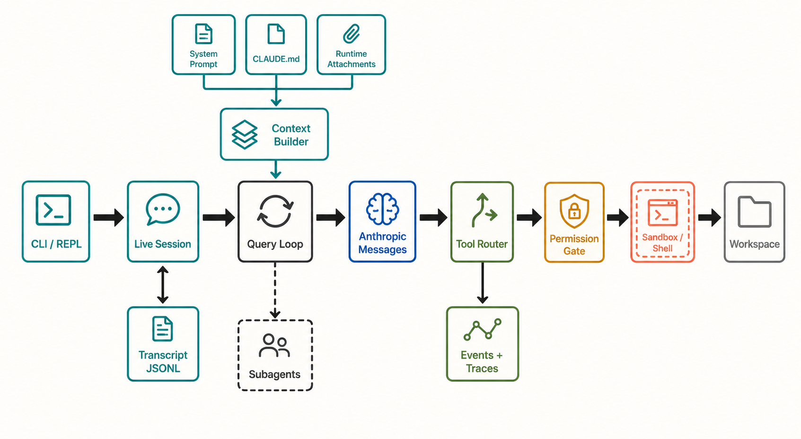

# Claude Code Harness 架构分析

> **证据边界。** 本报告分析 source-only commit `16a676f`。其 1,884 个 TS/TSX 文件、关键 symbol 与 feature gates 和论文所述 Claude Code v2.1.88 corpus 强指纹一致，但缺少 package version、上游 tree hash、build manifest，不能视为已证明的 exact 官方 artifact。快照仍有 657 个无法解析的相对 import；除 SiFlow 协议探针外，主循环、安全、session 与 subagent 结论均为 static-only。官方材料只支持产品立场，五价值/十三原则是 analyst synthesis。[X: X-001–X-003] [D: D-001–D-008] [C: C-001, C-024–C-026] 首次遇到缩写或内部名词时，可查 [全局术语表](16-glossary.md)。

## 核心结论

这个快照恢复出的核心不是一个“收到问题、调用一次模型、执行一个命令”的薄 CLI，而是共享、可递归的 `query()` 控制器。交互 REPL 与 print/SDK 各自准备 session、工具和 context，随后进入同一循环；循环可能在一个用户提交内发起多次 Anthropic Messages 请求，并在每次 `tool_use` 后经过验证、hook、权限、可选 sandbox、执行、`tool_result` 回填后继续。[S: S-004–S-009] [C: C-003–C-005]

*读者图问题：canonical runtime path 是什么，哪些服务从主线分支？ 这是 gpt-image-2 读者插图；当前实现边均为 static-only，结构化证据与排除项见 [图片元数据](../diagrams/generated/metadata.json)。*

**图怎么读。** 主线从左到右：界面进入 live session，session 调用 query loop，loop 调 Anthropic Messages，模型提出工具调用，Tool Router 再经过 Permission Gate 到执行后端。`Context Builder`、`Transcript JSONL` 和 `Subagents` 是主线的供给、持久化和递归分支。`Sandbox / Shell` 表示按配置选择 wrapper 后再执行，并不表示 sandbox 永远开启。[技术证据图](../diagrams/system-overview.svg)

## 定义架构的五个选择

下面只是一页式结论索引；每个选项、替代设计和术语的完整解释位于[设计空间章节](00-design-space-and-running-example.md)。

| 设计问题 | 该快照中的答案 | 主要代价与读者注意 |
|---|---|---|
| 多界面是否共用控制器 | 交互 REPL、`--print`/SDK 等 surface 先各自处理 UI、structured I/O、permission callback 和 live state，然后都消费共享 `query()` generator。 | 核心 loop 语义更一致，但不同 surface 的 approval UI、ESC、中断、排队和输出格式仍不同；不能把“共享 core”读成“所有入口行为完全相同”。 |
| context 如何增长 | Startup、lazy、per-turn、carry-forward 与 durable 来源在每次 model request 前合流，再经过 tool-result budget、snip、microcompact、collapse/autocompact 等变换。 | 这种流水线节省无关 context，但来源、顺序和 compaction survivor 更难追踪；静态分析不能量化摘要损失。 |
| 工具如何受控 | 工具从 registered capability 到 visible schema、requested tool_use、validated dispatch、hook/permission、可选 sandbox 和 backend call，经过多级状态转换。 | canonical tool path 有 gate，不自动证明 startup、hook、MCP lifecycle、bridge/daemon 等副作用面都同等受控；这些仍是审计边界。 |
| child 如何隔离 | Agent child 重建自己的 context、tool pool 与 sidechain transcript；普通 child 默认共享 cwd/files，显式 worktree 才提供工作区隔离。 | “subagent”不是单一 process/isolation 语义，必须分别看 context、policy、workspace、process、cancellation 和 result channel。 |
| 什么是 durable state | Transcript JSONL、sidechain、team inbox、compaction boundary 和部分 metadata 可跨进程恢复；普通 workspace 文件属于外部持久状态。 | Resume/fork 恢复 conversational/session view，不是事务式 rollback；临时 session permission grants 也不会从旧 transcript 静默恢复。 |

> **读者图待生成。** 问题：Surface、Core、Safety/Action、State 与 Backend 如何依赖？ evidence-grounded story spec 与 gpt-image-2 prompt 已生成；外部图像 API 尚未获本轮风险授权，因此当前不嵌入占位图或技术 SVG。

**分层不是目录树。** Surface 负责输入与呈现，Core 拥有 query loop 和 compaction 转移，Safety/Action 决定能力是否以及如何执行，State 管理 context 与 durable transcript，Backend 承接 shell、sandbox、workspace 和外部服务。同一源码目录可能同时服务两层；图表达责任和依赖，不声称物理部署隔离。

## 阅读路径

1. [产品立场、设计原则与实现机制](00-values-principles.md)
2. [设计空间与静态 running example](00-design-space-and-running-example.md)
3. [范围、证据和方法](01-scope-and-method.md)
4. [入口与生命周期](02-interfaces-lifecycle.md)
5. [共享核心循环](03-core-loop.md)
6. [Context、memory 与 compaction](04-context-memory-compaction.md)
7. [模型、工具与扩展](05-models-tools-extensions.md)
8. [权限、sandbox 与 workspace](06-permissions-sandbox-workspace.md)
9. [Subagent 与团队协作](07-subagents-delegation.md)
10. [Session、持久化与恢复](08-sessions-persistence-recovery.md)
11. [观测与评估边界](09-observability-evaluation.md)
12. [设计决策与权衡](10-design-decisions.md)
13. [运行实验](11-runtime-experiments.md)
14. [失败模式与开放问题](12-failure-modes.md)
15. [覆盖率与复现](13-coverage-reproducibility.md)
16. [源码与 claim 索引](14-source-claim-index.md)
17. [与 arXiv 2604.14228v2 的对照](15-paper-benchmark.md)
18. [全局术语表](16-glossary.md)

结构化真值位于 [HIR](../hir.json)、[claims](../evidence/claims.jsonl)、[observations](../evidence/observations.jsonl)、[coverage](../evidence/coverage.json) 和 [scenarios](../scenarios/catalog.json)。
