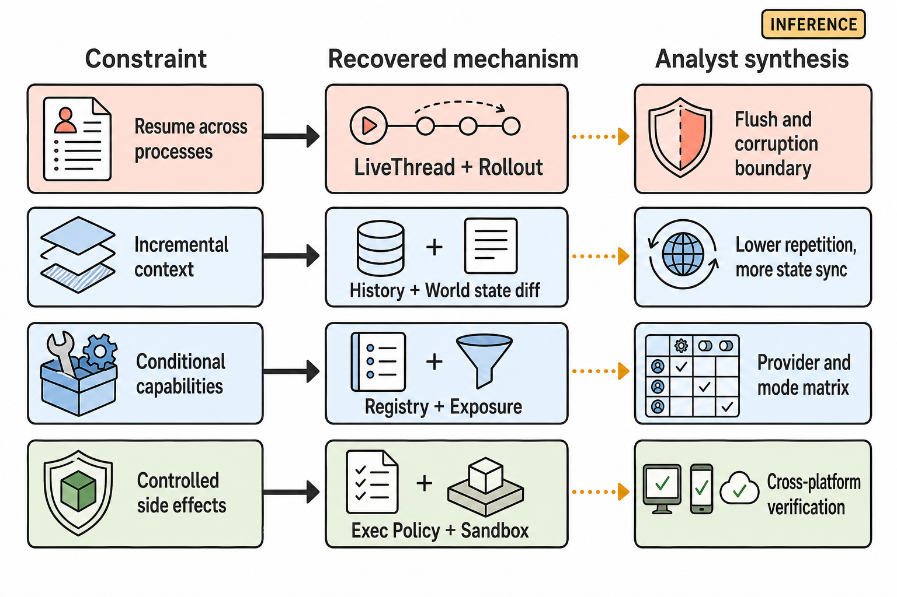

# 设计空间与 Running Example

> 图 8（gpt-image-2 读者插图）：四行把可观察约束、恢复出的机制和分析者综合的 tradeoff 分开；右列不是作者声明。Evidence: `D-002`, `D-004`, `D-007`, `S-005`, `S-009`, `S-012`, `S-014`, `S-018`, `S-025`, `X-002`, `X-004`, `X-006`。

<!-- EXPLANATION:design-space-figure -->
## 怎么读图 8

每一行都从左向右读：`Constraint` 是 harness 必须面对的问题，`Recovered mechanism` 是在 v0.144.5 源码中找到的当前实现，`Analyst synthesis` 是由实现推导出的工程代价。最后一列带 `INFERENCE`，是为了明确它不是 OpenAI 作者声明。

例如第一行不是说“rollout 一定会损坏”，而是说：既然跨进程 resume 依赖 `LiveThread + Rollout`，那么 flush 失败、尾部截断和 corruption 就成为必须测试的边界。第四行同理：`Exec Policy + Sandbox` 提供分层治理，但跨平台实现不同，所以不能用一次 Linux deny 实验推出所有平台都等价。[S: `S-012`–`S-014`, `S-018`, `S-019`] [X: `X-004`, `X-006`]

## 六个反复出现的设计问题

| 问题 | v0.144.5 的答案 | 可替代方案 | 可观察代价 | 证据 |
|---|---|---|---|---|
| 谁拥有耐久状态？ | ThreadStore/LiveThread + rollout JSONL | UI 进程内内存 | 可 resume/fork，但写入与 flush 成为 correctness 边界 | `S-018`, `S-019`, `X-006` |
| 每轮模型看见什么？ | history + world-state diff + per-turn tool exposure | 每轮重建完整 prompt | 减少重复，但缓存/同步语义更复杂 | `S-004`–`S-006`, `I-001` |
| 能力何时可见？ | registry 与 exposure 分离 | 所有已注册工具始终暴露 | 适配 provider/模式，但静态 registry 不能等同于实际 surface | `S-009`, `X-005` |
| 副作用如何治理？ | exec policy + approval + platform sandbox | 只审批或只 sandbox | 边界更完整，但跨平台和 mode matrix 更难验证 | `D-002`, `S-012`–`S-014`, `I-002` |
| 多 agent 如何隔离？ | 独立 child context/history，共享 cwd/policy | 单 context 内角色切换或完全独立 workspace | 控制 context 增长，但共享文件产生竞争 | `S-015`–`S-017`, `X-005` |
| 失败后从哪恢复？ | turn retry/cancel + rollout flush + thread resume | 整个进程重启或事务 checkpoint | 局部恢复成本低，但没有一个覆盖所有失败的统一机制 | `S-008`, `S-022`, `X-006` |

## Running example：一次确定性的 read tool turn

本报告用 `X-SCENARIO-002` 作为主线，因为它只要求 harness 机制，不依赖模型随机选择工具：本地 Responses fixture 首次强制返回 `exec_command(cat FACTS.txt)`；只有第二次请求包含同一 `call_id` 的 `function_call_output` 时，fixture 才返回 `HXA-1445`。

观测顺序是：请求 1（3 个 message items）→ function call → 只读执行 → tool output 进入 history → 请求 2（新增 function call/output）→ assistant final → turn complete。这个 trace 支持核心循环和 context feedback，但**不支持** compaction、MCP、write sandbox 或 subagent 等没有发生的路径。[X: `X-002`]

权限拒绝、subagent 与 resume 分别来自 `X-SCENARIO-004/005/006`，在后文作为独立支路附着，避免把多个实验拼成一次不存在的“全功能运行”。
