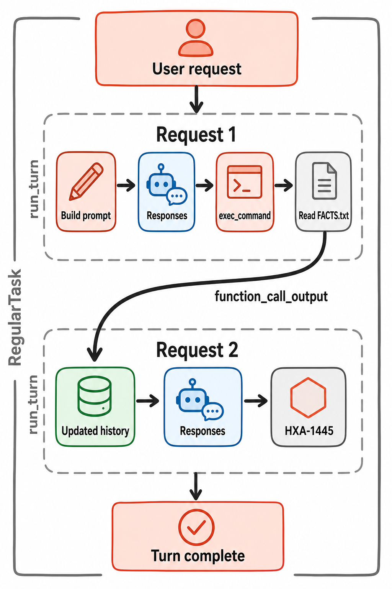

# 核心循环与编排

> 图 2（gpt-image-2 读者插图）：严格对应 `X-SCENARIO-002` 的两次 Responses 请求；permission、compaction、subagent 等未发生路径没有混入主轴。Evidence: `S-002`, `S-003`, `S-010`, `S-025`, `X-002`。

## 两层循环

外层 `RegularTask` 管一个用户 turn：发开始事件、调用 `run_turn`、处理排队输入。[源码](https://github.com/openai/codex/blob/87db9bc18ba5bc82c1cb4e4381b44f693ee35623/codex-rs/core/src/tasks/regular.rs#L37) 内层 `run_turn` 才是 agent loop：检查 compaction、刷新 world state/skills/hooks、构造 prompt、采样、dispatch tools、判断 follow-up，最后执行 stop hooks 和结束事件。[源码](https://github.com/openai/codex/blob/87db9bc18ba5bc82c1cb4e4381b44f693ee35623/codex-rs/core/src/session/turn.rs#L224) [S: `S-002`, `S-003`]

`OutputItemDone` 遇到 function/custom tool 时不会同步阻塞整个 stream parser，而是创建 tool future；Response completed 后再综合 `needs_follow_up`、pending input 与 compaction 条件。只读/parallel-capable handler 可共享读锁，exclusive handler 获取写锁。[源码](https://github.com/openai/codex/blob/87db9bc18ba5bc82c1cb4e4381b44f693ee35623/codex-rs/core/src/tools/parallel.rs#L42) [S: `S-025`]

## 被实验验证的闭环

`X-SCENARIO-002` 的 provider 日志显示第一次 input types 是三条 `message`；第二次变成 `message ×3 + function_call + function_call_output`。fixture 只有看到 `call-read` output 才返回最终值，因此“tool result 确实进入下一轮模型上下文”不是根据最终文本猜测。[X: `X-002`]

`X-SCENARIO-003` 又验证错误分支：未知工具在 router/registry 处产生 unsupported error，但该错误作为 tool output 回到模型，turn 仍可结束。[X: `X-003`]

## 停止与恢复

正常停止条件是 response complete 且没有 tool follow-up/pending input；取消由 token 传播到 tool runtime，provider stream retry 有界。开始新 task 会 abort 旧 task；turn 完成前尝试 flush rollout。[S: `S-008`, `S-022`]

未覆盖：并行多 tool 的真实 interleaving、user interrupt、stream idle、stop hook 阻断和中途 compaction。因此图 2 只表达已经发生的 read-only 主线。
