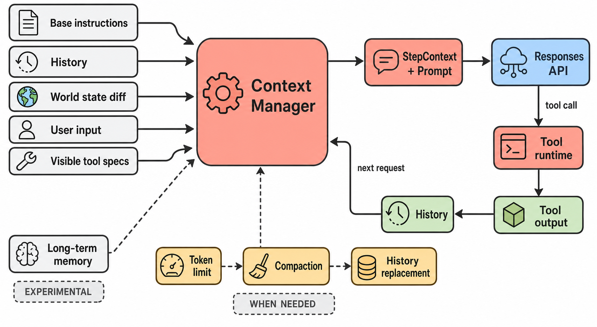

# 上下文、记忆与压缩

> 图 3（gpt-image-2 读者插图）：区分 durable history、per-turn world-state diff、请求级 StepContext 与条件 compaction；所有来源必须先汇入 Context Manager 才到模型。Evidence: `D-007`, `S-004`–`S-007`, `S-020`, `X-002`, `X-006`。

<!-- EXPLANATION:context-figure -->
## 图 3 的节点和回路

| 图中节点 | 具体表示什么 |
|---|---|
| Base instructions | config override、persisted conversation metadata 或 model default 选出的基础指令 |
| History | 已规范化的模型可见 message/tool items；图中左右两个 History 图标是同一份 history 的两个视图 |
| World state diff | AGENTS、环境、subagents、apps/plugins 等相对 baseline 的 typed snapshot/diff |
| Visible tool specs | registry 中经过当前 provider、feature 和 exposure 规则筛出的本轮工具 schema |
| Context Manager | 负责 history 顺序、token 估计和 world-state baseline 的内存状态管理器 |
| `StepContext + Prompt` | 把本次请求固定的 cwd/model/policy/tools 与输入组合成 sampling 所需对象 |
| Tool runtime/output | 模型提出调用后，由 harness 执行并产生可追加到 history 的结果 |

右侧闭环要读成 `Responses API → Tool runtime → Tool output → History → Context Manager → next request`。下方 compaction 是另一条条件回路：达到 token/window 阈值后生成 replacement，再用 replacement 改写模型可见 history。`History replacement` 不是回滚 workspace，也不是删除 durable rollout；它改变的是后续模型请求的有效上下文。[S: `S-005`–`S-007`] [X: `X-002`]

`Long-term memory` 带 `EXPERIMENTAL`，表示它属于默认关闭的 memories feature；`WHEN NEEDED` 表示 compaction 是阈值触发，不是每轮固定执行。

## History 与 world state

`ContextManager` 按 oldest-first 保留模型可见 items、token info、reference item 和 world-state baseline；append 时只记录可进入 API 的 messages，并做 prompt normalization / modality filtering。[源码](https://github.com/openai/codex/blob/87db9bc18ba5bc82c1cb4e4381b44f693ee35623/codex-rs/core/src/context_manager/history.rs#L36) [S: `S-005`]

另一个状态面是 typed world state：AGENTS instructions、environment/subagents、apps、plugins、extension contributors 等可形成 snapshot 或 RFC 7386 风格 diff。[源码](https://github.com/openai/codex/blob/87db9bc18ba5bc82c1cb4e4381b44f693ee35623/codex-rs/core/src/context/world_state/mod.rs#L206) [S: `S-006`] 这让“当前环境变化”不必反复复制整个历史，但也意味着 history 与 baseline 的同步是 correctness 边界。[I: `I-001`]

每一轮的 `StepContext` 绑定当前 cwd、policy、model、tools 等请求级语义；tool invocation 保存精确 StepContext，避免并发工具读取到下一 turn 的配置。[S: `S-004`, `S-010`]

## Compaction 不是单一路径

源码至少有三种触发：turn 前 token 超限、tool follow-up 中超限、模型兼容性/窗口下调。选择器再区分 remote v2、remote v1 与 local compact；compaction 会安装替换后的 history 并重算 token usage。[源码](https://github.com/openai/codex/blob/87db9bc18ba5bc82c1cb4e4381b44f693ee35623/codex-rs/core/src/session/turn.rs#L798) [S: `S-007`]

本轮没有构造足够长的 context，所以图中的 compaction 是静态虚线，不能宣称在默认任务中出现频率。

## 长期 memory

`memories` 默认关闭。启用后 Phase 1 从 eligible rollout 提取结构化记忆并 redaction，Phase 2 在全局锁/租约下由专用 consolidation agent 合并到 durable files。[文档](https://github.com/openai/codex/blob/87db9bc18ba5bc82c1cb4e4381b44f693ee35623/codex-rs/memories/README.md#L1) [S: `S-020`] 它不是普通 turn 的同步 message append，也不等同于 session rollout。
