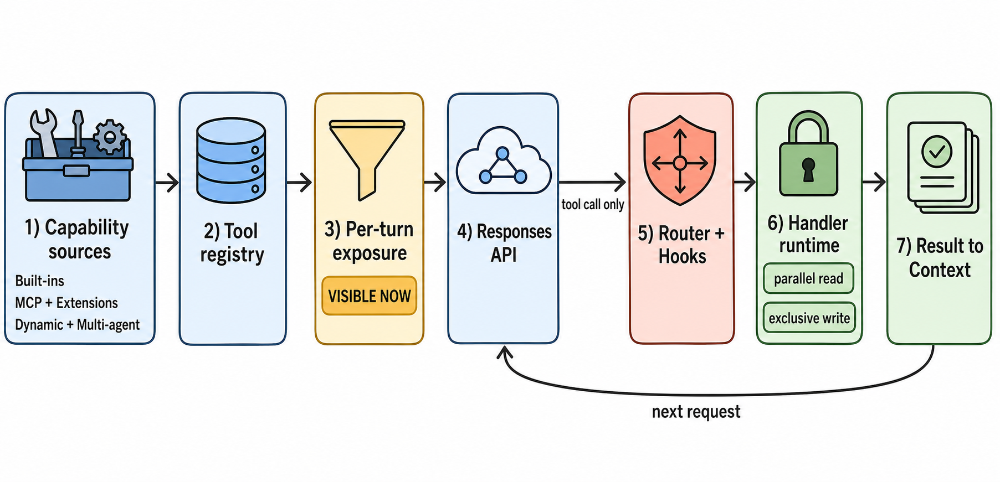

# 模型、工具与扩展

> 图 4（gpt-image-2 读者插图）：左侧是注册来源，中间区分 registry 与 per-turn exposure，右侧才是 router/hook/handler/result。虚线能力在测试配置中未启用。Evidence: `S-004`, `S-009`–`S-011`, `S-024`–`S-026`, `X-002`, `X-003`, `X-005`。

<!-- EXPLANATION:tool-figure -->
## 图 4 的七段能力管线

这张图最容易误读成“工具注册后马上执行”。实际上必须按编号从左向右读：

1. **Capability sources**：`Built-ins` 是 Codex 自带工具；`MCP + Extensions` 是外部/插件贡献；`Dynamic + Multi-agent` 是 host 在运行时提供的函数和 feature-gated collaboration 工具。
2. **Tool registry**：保存 tool name 到 handler implementation 的映射。进入 registry 只说明 Codex 知道如何处理它，不代表模型现在看得见。
3. **Per-turn exposure**：`VISIBLE NOW` 是本次 request 的公开子集。provider capability、feature flag、agent depth 和 deferred/hidden 规则都会改变它。例如 root 有 `spawn_agent`，达到深度上限的 child 可以没有。
4. **Responses API**：模型收到 prompt 和暴露后的 tool schemas。图上自动生成的 `tool call only` 只是强调这条箭头承载 model-proposed tool call，不是说 Responses 只能返回工具调用；它也可以返回普通 assistant text。
5. **Router + Hooks**：router 解析 function/custom/namespace call，绑定准确的 `StepContext`；pre-tool hooks 可在 handler 前阻断或改写输入。
6. **Handler runtime**：真正执行 handler。`parallel read` 表示允许并行的工具共享读锁；`exclusive write` 表示有副作用或需独占的工具获取写锁。这个分类由 handler capability 决定，并非按工具名称猜测。
7. **Result to Context**：成功值或 model-facing error 被包装成 tool output，追加到 history；`next request` 才让模型看到它。

以报告的 read scenario 为例：`exec_command` 已在 registry，read-only 配置下也处于 exposure；模型提出 call 后 router 找到 handler，runtime 读取文件，结果回到 context，再发第二次 Responses 请求。`X-SCENARIO-003` 的未知工具则在 router/registry 查找阶段失败，但错误仍沿第 7 段返回模型。[S: `S-009`–`S-011`, `S-025`, `S-026`] [X: `X-002`, `X-003`, `X-005`]

## 固定版本的内置工具清单

Codex `rust-v0.144.5` 没有一个对所有 request 恒定的“默认工具数组”。`ToolSpecPlan` 每个 turn 按 environment、model/provider capability、feature、tool mode 和 agent depth 组装 runtimes，再把其中 direct exposure 的 specs 发给模型；所以表中“内置”表示 core 自带 handler/spec，不表示本轮一定 visible。[源码：tool sources](https://github.com/openai/codex/blob/87db9bc18ba5bc82c1cb4e4381b44f693ee35623/codex-rs/core/src/tools/spec_plan.rs#L583) [S: `S-009`]

| 类别 | 内置工具名 | 加入/可见条件 | 主要作用 |
|---|---|---|---|
| 计划 | `update_plan` | core utility builder 总会注册；code-mode 可把它作为 nested tool。 | 更新结构化 plan steps/status。 |
| Shell: unified exec | `exec_command`、`write_stdin` | 有 execution environment，且 model/feature 选择 `UnifiedExec`。legacy `shell_command` 同时保留为 dispatch-only，不发给模型。 | 启动/轮询交互式命令、写 stdin。 |
| Shell: legacy/local | `shell_command` | 有 environment，且 shell type 为 Default/Local/ShellCommand。 | 执行 shell 命令；与 `exec_command` 是按配置二选一的模型表面。 |
| 文件补丁 | `apply_patch` | 有 environment，且 model 声明 `apply_patch_tool_type`。 | 解析并应用 patch；也可从 shell/unified-exec 输入被提前拦截到专用 patch runtime。[S: `S-028`] |
| 本地媒体 | `view_image` | 有 environment；schema 是否允许 `detail=original` 还取决于 model capability。 | 读取本地图片并作为模型输入返回。 |
| 用户与权限 | `request_user_input`、`request_permissions` | 前者需 experimental config；后者需 environment + `RequestPermissionsTool` feature。 | 请求用户选择，或请求扩大当前 tool permission。 |
| Deferred environment | `wait_for_environment` | `DeferredExecutor` feature。 | 等待 deferred/remote execution environment 状态。 |
| Token/context | `new_context`、`get_context_remaining` | `TokenBudget` feature；`new_context` 是 direct-model-only。 | 创建新 context window，或查询剩余 context。 |
| 时间 | `clock.curr_time`、`clock.sleep` | `CurrentTimeReminder`；sleep 还需 reminder config 开启。namespace tools 需 provider 支持。 | 读取当前时间或等待指定时长。 |
| Tool/plugin discovery | `tool_search`、`list_available_plugins_to_install`、`request_plugin_install` | tool search 需 provider 支持 search + namespace；plugin tools 还需 ToolSuggest + Apps + Plugins 和候选项。 | 发现 deferred tools，或请求安装明确匹配的 plugin/connector。 |
| MCP resource helpers | `list_mcp_resources`、`list_mcp_resource_templates`、`read_mcp_resource` | 当前 session 存在 MCP tool state。 | 浏览/读取 MCP resources；不是 MCP server 动态提供的业务 tool。 |
| Multi-agent V1 | `spawn_agent`、`send_input`、`resume_agent`、`wait_agent`、`close_agent` | V1 开启且未超过 depth；provider 支持 namespace 时合并进 V1 namespace，tool search 开启时可 deferred。 | 管理 child session 生命周期和输入。 |
| Multi-agent V2 | `spawn_agent`、`send_message`、`followup_task`、`wait_agent`、`interrupt_agent`、`list_agents` | V2 feature/config；可按配置放入 namespace 或 direct-model-only。 | V2 agent tree、mailbox、follow-up 与 interrupt。 |
| Agent jobs | `spawn_agents_on_csv`、`report_agent_job_result` | `SpawnCsv` + collaboration；report 只给 agent-job worker。 | 批量派生 CSV 任务并回报 worker 结果。 |
| Provider-hosted | `web_search`（具体 schema type 由 model info 决定） | 非 Responses Lite、provider 支持 web search，且未被 standalone `web.run` 替代。 | 由 provider 执行 web search，不经过普通本地 handler。 |
| Test-only | `test_sync_tool` | model `experimental_supported_tools` 显式包含该名字。 | 同步测试，不属于正常产品默认面。 |

此外，Code Mode 会增加一个公共 JavaScript executor 和对应 wait handler，并把可嵌套工具投影到其内部；公开名称来自 `codex_code_mode` dependency，不应在本仓库证据不足时硬编码。MCP runtime tools、extension executors 和 host dynamic tools 虽然进入同一个 registry，但它们的名称/实现由外部 server、extension 或 host 提供，因此不属于 core 内置工具。

## Model boundary

`ModelProviderInfo` 把 base URL、auth、wire transport、request/stream retry 与 remote compaction capability 收拢到 provider abstraction；`ModelClientSession` 保存 turn 内稳定 transport 状态和 WebSocket fallback。[源码](https://github.com/openai/codex/blob/87db9bc18ba5bc82c1cb4e4381b44f693ee35623/codex-rs/model-provider-info/src/lib.rs#L90) [S: `S-008`, `S-024`]

请求不是直接由 history 序列化：prompt 还包含 base instructions、output schema 和当前模型可见 tool specs。[源码](https://github.com/openai/codex/blob/87db9bc18ba5bc82c1cb4e4381b44f693ee35623/codex-rs/core/src/session/turn.rs#L1084) [S: `S-004`]

## Registry != exposure

`ToolSpecPlan` 同时生成 handler registry 与 model-visible specs；hidden/deferred tools 可以存在于 registry 却不出现在请求中。内置 shell、utility、collaboration、MCP runtime、extensions、dynamic 与 hosted tools 在当前 StepContext 下合成。[源码](https://github.com/openai/codex/blob/87db9bc18ba5bc82c1cb4e4381b44f693ee35623/codex-rs/core/src/tools/spec_plan.rs#L158) [S: `S-009`]

这一点被 `X-SCENARIO-005` 直观证实：root 请求带 `multi_agent_v1` namespace；达到默认 child depth 后，child 请求不再带该 namespace。**扫描到 spawn handler 不等于每个 agent 都能 spawn。**

## Dispatch 与 extension points

`ToolRouter` 解析 function/custom/namespace call，构造绑定 StepContext 的 invocation；registry 查找 handler、发 telemetry、运行 pre-tool hooks，再 dispatch。[源码](https://github.com/openai/codex/blob/87db9bc18ba5bc82c1cb4e4381b44f693ee35623/codex-rs/core/src/tools/router.rs#L112) [S: `S-010`, `S-011`]

MCP handler 根据 read-only annotation 决定并行能力并截断 output；dynamic tool 由 host 提供 schema，调用时等待 host response。[S: `S-026`] 这意味着 extension surface 同时跨越“模型可见 schema”和“谁真正执行副作用”两个边界，不能只画一张包依赖图。
