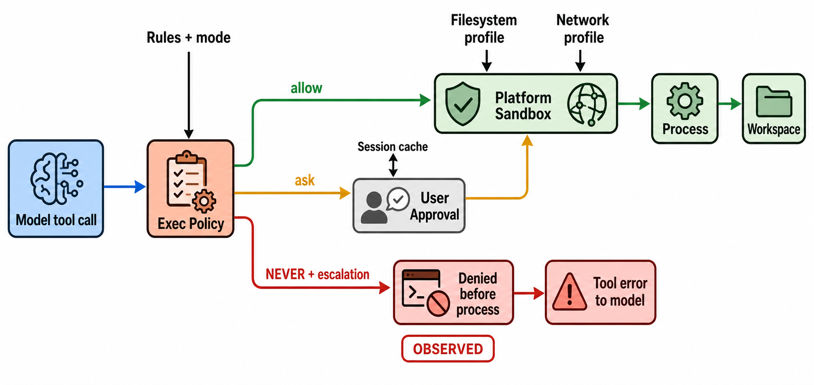

# 权限、Sandbox 与 Workspace

> 图 5（gpt-image-2 读者插图）：三分支明确区分 allow 直达 sandbox、ask 经 User Approval，以及 deny；红色拒绝支路是 `X-SCENARIO-004` 实际发生路径，sandbox backend 未执行。Evidence: `D-002`, `S-012`–`S-014`, `X-004`, `X-007`, `I-002`。

## 决策层

`ExecPolicy` 先把复合命令拆成 segments，综合 rules 与 fallback。只有每个 segment 都显式 allow 才能绕过额外 sandbox 决策；危险/未知命令在不同 approval mode 下会 forbid、prompt 或依赖 sandbox。[源码](https://github.com/openai/codex/blob/87db9bc18ba5bc82c1cb4e4381b44f693ee35623/codex-rs/core/src/exec_policy.rs#L169) [S: `S-012`]

`AskForApproval` 包含 `UnlessTrusted`、`OnRequest`、`Granular`、`Never`。session approval cache 只复用明确的 `ApprovedForSession`，并不是把一次批准变成全局 allow。[S: `S-013`]

## 执行层

通过 policy 后，`SandboxManager` 将 filesystem/network permission profile 转换为平台执行后端：Linux、macOS、Windows 有不同 transform 与 fallback。[源码](https://github.com/openai/codex/blob/87db9bc18ba5bc82c1cb4e4381b44f693ee35623/codex-rs/core/src/exec.rs#L117) [D: `D-002`] [S: `S-014`]

因此可审计边界是组合关系：policy 决定是否允许/询问/拒绝，sandbox 限制获准执行能触达什么。[I: `I-002`] 把二者任意一个画成“唯一安全层”都会丢失真实语义。

## 反例实验

fixture 请求 `touch forbidden-marker` 且显式 `sandbox_permissions=require_escalated`，配置为 `approval_policy=never`。router 返回 “you cannot ask for escalated permissions if the approval policy is Never”；随后 fixture 只有收到 tool output 才结束。运行前后 `FACTS.txt` SHA-256 都是 `277992...8ed`，目录仍只有 `FACTS.txt`。[X: `X-004`, `X-007`]

这证明 **never+require_escalated 的前置拒绝**，但没有证明 read-only sandbox 能阻挡所有绕行，也没有覆盖 MCP/dynamic tool 是否共享相同 exec gate。
