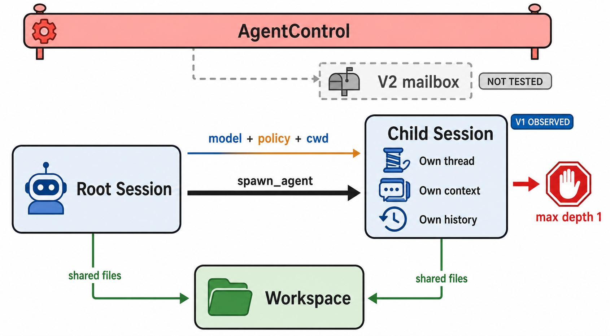

# Subagent 与 Delegation

> 图 6（gpt-image-2 读者插图）：V1/V2 是两条条件路径；本轮只运行 V1。Child 拥有独立 context/history/thread，继承 policy/cwd，workspace 共享；默认 `max_depth=1` 使 child 不再暴露 spawn namespace。Evidence: `S-015`–`S-017`, `S-027`, `X-005`。

<!-- EXPLANATION:subagent-figure -->
## 图 6 中每个标签是什么意思

`AgentControl` 是一个 root agent tree 共享的控制面，负责 agent registry、并发/深度限制、消息发送、interrupt 和 child 生命周期。`Root Session` 与 `Child Session` 是两个独立 Codex session；`spawn_agent` 创建 child 后，child 拥有自己的 thread id、model-visible context 和 history，因此 child 的中间推理不会自动塞进 root history。[S: `S-015`, `S-016`]

图上方的 `model + policy + cwd` 表示 child 从父 turn 的 effective configuration 继承 model provider、approval policy、sandbox policy 和工作目录；这不是共享 context。下方两条 `shared files` 线表示 root/child 看见同一个 workspace，所以 context 隔离并不能避免文件竞争。`max depth 1` 是本版本默认配置：达到深度上限的 child 不再暴露 spawn namespace，并不表示 child 不能使用普通工具。[S: `S-015`–`S-017`] [X: `X-005`]

### `V2 mailbox` 的准确含义

它不是电子邮件服务，也不是一个额外 agent。它是 MultiAgent V2 的 **session-scoped inter-agent message queue**：child completion 或 agent-to-agent communication 先进入 parent 的 pending mailbox，再由 parent turn 决定何时吸收。

- turn 开始时处于 `CurrentTurn`，pending mail 可以加入当前 turn 的下一次 model request。
- parent 已输出用户可见 final 后，晚到 mail 通常留在队列，推迟到 `NextTurn`，避免悄悄延长已经显示完成的答案。
- 如果 parent 仍在 reasoning/commentary 阶段发现 pending mail，sampling 可以提前结束并进入 follow-up，使新消息更快进入 context。
- V2 child 的 terminal event 会被包装成 completion message 转发给直接 parent。

图上的虚线和 `NOT TESTED` 表示这套逻辑只由固定 commit 的源码确认，本轮没有启用 V2 动态验证；本轮真正观察到的是 V1 `spawn_agent` 路径。[S: `S-027`] [X: `X-005`]

## 静态拓扑

一个 root tree 共享 `AgentControl`、registry/limiter/rollout budget；`CodexDelegate` 创建独立 child Codex，拥有自己的 channels、session、context 与 history，同时继承 effective config、provider、approval、sandbox、cwd、MCP、skills 和 tools。[源码](https://github.com/openai/codex/blob/87db9bc18ba5bc82c1cb4e4381b44f693ee35623/codex-rs/core/src/codex_delegate.rs#L70) [S: `S-016`]

历史继承不是单一布尔值：full-history fork 保留 user/developer/final assistant 和 metadata；truncated fork 强制 child 重建上下文。[S: `S-017`]

默认配置中 V1 `multi_agent` 开启，V2 关闭；默认最大 child threads 为 6，V2 并发 session 为 4，深度为 1。[源码](https://github.com/openai/codex/blob/87db9bc18ba5bc82c1cb4e4381b44f693ee35623/codex-rs/core/src/config/mod.rs#L203) [S: `S-015`] 这些数字是版本/配置条件，不应画成 harness 的普遍常数。

## 继承与隔离矩阵

| 维度 | V1 child 的默认语义 | V2 / 条件差异 | 本轮验证边界 |
|---|---|---|---|
| Context/history | Child 创建独立 session、channel、context 与 history；可 full-history fork 或 truncated rebuild。 | V2 还按 `fork_turns`/communication context 选择传播内容。 | V1 请求 digest 与 root 不同；完整 survivor 差分未跑。 |
| Model/provider | 从 parent effective config 派生，child 可继续使用相同 provider/model。 | Role/config 可以覆盖默认值。 | 只验证测试 fixture 下请求可达，没有跑多 provider matrix。 |
| Tools/exposure | 重新构造 child tool surface；达到默认 depth 后不再暴露 spawn namespace。 | V1/V2 namespace、并发限制与 usage hints 不同。 | `X-005` 只覆盖 V1 depth=1。 |
| Approval/sandbox/exec policy | 继承 effective approval、permission/sandbox、cwd；exec policy 只有 config folder/requirement 等价时才可共享 manager。 | V2 可携带额外 communication/policy context。 | 未做 child permission deny 或 escalation experiment。 |
| Workspace/process | 独立 child session/task，但普通 child 使用相同 cwd/filesystem。 | 外部 remote/worktree 隔离不在该默认路径中。 | 未做并发同文件写入或 process crash。 |
| Cancellation/result | 共享 AgentControl 管理 interrupt/lifecycle；result 通过 parent-facing event/message 返回。 | V2 completion 先进入 session mailbox，再按 turn phase 当前轮或下一轮消费。 | V1 spawn 已观察；join/cancel/V2 mailbox 未运行。 |

## 动态观察

`X-SCENARIO-005` 的 root request 暴露一个 `multi_agent_v1` namespace，随后 `spawn_agent` event 返回新的 child thread id。日志出现三个 provider requests：root 首次、root tool-output follow-up、child 首次。child request 有不同 input digest，且不再带 namespace，符合默认 depth limit。[X: `X-005`]

尚未验证：父进程等待/聚合 child final、child crash、cancel propagation、多个 child 同文件写冲突、V2 mailbox/preemption。图中这些未运行机制均不能用实线。
