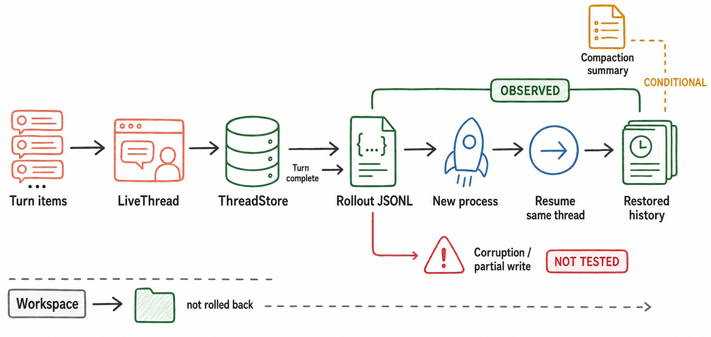

# Session、持久化与恢复

> 图 7（gpt-image-2 读者插图）：主轴是 session items → LiveThread → rollout JSONL → resume → restored history；workspace 是并行现实状态，不会因 resume 自动回滚。Evidence: `D-004`, `S-018`, `S-019`, `S-022`, `X-006`。

<!-- EXPLANATION:persistence-figure -->
## 图 7 的持久化链条

| 阶段 | 作用 |
|---|---|
| Turn items | user/assistant/tool/compaction 等已经规范化、准备持久化的事件 |
| `LiveThread` | 当前活跃 session 使用的高层持久化 handle；过滤 rollout items，并同步派生 metadata |
| `ThreadStore` | storage-neutral 接口；core 不需要知道后端是本地文件、内存还是仓库外实现 |
| Rollout JSONL | local store 的 canonical append history；用于重建 conversation history |
| New process | 原进程结束后启动的另一个 Codex CLI/app-server process |
| Resume same thread | 用同一 thread id 调用 store 的 resume/load history |
| Restored history | 重新进入 `ContextManager`、供后续 model request 使用的有效会话历史 |

`Turn complete → Rollout JSONL` 旁的小箭头表示完成 turn 前会尝试 flush，不表示只有 turn 完成时才 append。`OBSERVED` 覆盖的是正常 create、flush、换进程、resume 路径。[S: `S-018`, `S-019`, `S-022`] [X: `X-006`]

图下方的 `Workspace — not rolled back` 是另一条状态轨道：rollout 记录对话和 tool items，但 resume 不会把文件恢复到旧版本。上方 `Compaction summary — CONDITIONAL` 表示恢复的 history 可能包含压缩后的模型可见表示；它不是另一个 thread store。`Corruption / partial write — NOT TESTED` 是明确的未知项，本轮没有故意截断 JSONL，也没有证明损坏文件能自动修复。

## Live 与 durable state

`ThreadStore` 是 storage-neutral interface，覆盖 create/resume/append/persist/flush/shutdown/load/list/archive/delete；`LiveThread` 是活动持久化边界，resume 时加载 history，append 时先做 persistence filtering 和 metadata patch。[源码](https://github.com/openai/codex/blob/87db9bc18ba5bc82c1cb4e4381b44f693ee35623/codex-rs/thread-store/src/live_thread.rs#L91) [D: `D-004`] [S: `S-018`]

local store 的 rollout 文件采用 `rollout-<timestamp>-<thread-id>.jsonl`。后台 writer 在 I/O error 时保留 pending suffix，turn complete 前 task 会 flush，并把失败作为 warning/retry surface。[源码](https://github.com/openai/codex/blob/87db9bc18ba5bc82c1cb4e4381b44f693ee35623/codex-rs/rollout/src/recorder.rs#L1511) [S: `S-019`, `S-022`]

## 跨进程验证

首个非 ephemeral exec 创建 thread `019f6985-7c75-7610-b31a-9749f4221892`，并产生相同 id 的 rollout JSONL。第二个进程执行 `exec resume <id>`，输出的 `thread.started` id 不变；fixture 日志显示 provider input 从 3 items 增到 5 items，新增首轮 assistant 与第二轮 user message。[X: `X-006`]

这证明了正常尾部写入后的 resume，不证明中间 JSONL 损坏、flush 半失败、schema 迁移或 workspace drift 的恢复策略。特别是 workspace 是共享外部状态，resume conversation 不等于文件系统 rollback。
