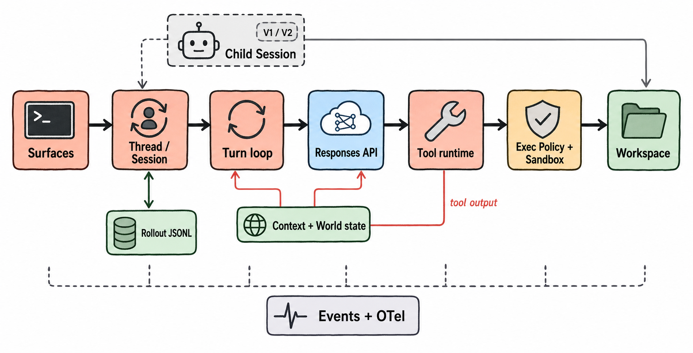

# OpenAI Codex 0.144.5 Harness 架构分析

> 冻结对象：`rust-v0.144.5`，peeled commit `87db9bc18ba5bc82c1cb4e4381b44f693ee35623`。本报告分析的是 Codex harness，而不是模型本身，也不把代码形状推断出的理由冒充作者意图。首次遇到内部类型、状态名或缩写时，可查[全局术语表](16-glossary.md)。

> 图 1（gpt-image-2 读者插图）：中央主轴是本轮恢复出的 canonical path；exec governance 位于主轴；持久化、subagent 与 telemetry 是有明确注入点的支路。图片不是架构真值，结构依据见 [HIR](../hir.json)、[claims](../evidence/claims.jsonl) 与[图像元数据](../diagrams/generated/metadata.json)。Evidence: `S-001`–`S-019`, `X-001`, `X-002`, `X-004`, `X-005`, `X-006`。

<!-- EXPLANATION:report-glossary -->
## 先读懂图 1：这些方框不是源码目录

图 1 把多个 Rust 类型聚合成读者可理解的运行职责。例如 `Thread / Session` 同时概括 thread manager、session 和 active persistence handle；`Tool runtime` 概括 tool spec、router 与 handler execution。它不是“一个方框对应一个文件”的包依赖图。

从左到右的实线是一次使用 `exec_command` 时的主路径：入口创建或恢复 thread，turn loop 组装请求，Responses API 返回模型输出，tool runtime 解释工具调用，`Exec Policy + Sandbox` 决定并约束副作用，最后才触达 workspace。下方红色回路表示 tool output 先进入 context，再触发下一次 model request；它不是 tool 直接调用模型。

图中常用词可以先这样理解：

| 术语 | 本报告中的准确含义 |
|---|---|
| thread | 可持久化、可 resume/fork 的会话身份和历史容器 |
| session | 当前进程中负责处理该 thread 的运行对象 |
| turn | 一次用户请求到 `TurnComplete/TurnAborted` 的调度单位；内部可有多次模型请求 |
| `StepContext` | 某次 sampling/tool invocation 固定使用的 model、cwd、policy、tools 等请求级快照 |
| context | 模型可见 history、动态 world state、当前输入和 tool specs 的组合 |
| rollout | 按顺序记录 session items 的 durable JSONL 事件历史 |
| registry | 当前进程已经有实现的工具集合 |
| exposure | 本次 model request 实际向模型公开的工具子集 |
| mailbox | V2 agent 之间暂存 completion/message 的 session-scoped 通信队列 |
| OTel | OpenTelemetry；独立于产品事件的 logs/traces/metrics 输出层 |

图片只承担“快速建立心智模型”；条件、例外和精确定义以相应章节、[HIR](../hir.json)和 evidence 为准。

## 一句话结论

Codex 0.144.5 不是“一个 while-loop 加几个工具”，而是一个以 **thread/session 为耐久边界、turn 为调度边界、StepContext 为请求边界、policy+sandbox 为副作用边界** 的分层 harness。核心复杂度集中在四处：增量 context/world state、动态 tool exposure、跨 turn/session 的恢复语义，以及 feature-gated 的多 agent 树。

## 五个最重要的发现

1. `run_turn` 是模型-工具闭环；`RegularTask` 负责 turn 生命周期和排队输入，不是第二套 loop。[S: `S-002`, `S-003`] [X: `X-002`]
2. context 不只是 message list：模型可见 history 与可差分 world state 分开维护，compaction 会替换信息而非仅截断字符串。[S: `S-005`–`S-007`]
3. registry 与 exposure 分离，当前 provider/config 决定模型看见哪些已注册能力；V1 multi-agent 的 namespace tool 就是一个条件 surface。[S: `S-009`] [X: `X-005`]
4. 对真正创建进程的 exec 路径，approval/exec policy 在 platform sandbox 前决策；`never` 对提权请求是前置硬拒绝。但 shell 中的 `apply_patch` 会先被识别并进入专用 patch safety、按路径 approval 与 sandbox runtime，不能把普通 exec 顺序泛化到所有工具输入。[S: `S-012`–`S-014`, `S-028`] [X: `X-004`, `X-007`]
5. thread durability 不是 UI 附件：LiveThread/ThreadStore/rollout 构成可恢复状态模型；跨进程 resume 已被本轮实验证实。[S: `S-018`, `S-019`] [X: `X-006`]

## 阅读路径

- [设计空间与 running example](00-design-space-and-running-example.md)
- [范围与方法](01-scope-and-method.md)
- [接口与生命周期](02-interfaces-lifecycle.md)
- [核心循环](03-core-loop.md)
- [上下文、记忆与压缩](04-context-memory-compaction.md)
- [模型、工具与扩展](05-models-tools-extensions.md)
- [权限、sandbox 与 workspace](06-permissions-sandbox-workspace.md)
- [Subagent 与 delegation](07-subagents-delegation.md)
- [Session、持久化与恢复](08-sessions-persistence-recovery.md)
- [可观测性](09-observability.md)
- [设计决策与权衡](10-design-decisions.md)
- [运行实验](11-runtime-experiments.md)
- [失败模式与开放问题](12-failure-modes-open-questions.md)
- [覆盖率与复现](13-coverage-reproducibility.md)
- [源码与 Claim 索引](14-source-claim-index.md)
- [全局术语表](16-glossary.md)
