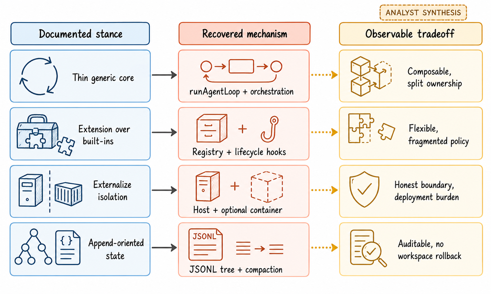
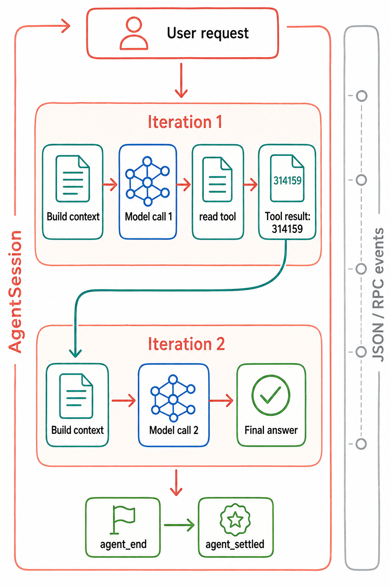

# 00 设计空间与贯穿案例

Pi 的架构不能只用“有哪些 package”来解释。更有区分度的问题是：推理放在哪里、产品编排由谁拥有、默认信任边界在哪里、上下文和持久状态如何增长，以及扩展能力由核心还是用户定义。

## 六个设计问题

| 设计问题 | Pi `v0.80.7` 的答案 | 可选设计 | 证据与置信度 |
|---|---|---|---|
| 推理与控制放在哪里？ | 模型决定下一步；`runAgentLoop()` 只负责 model/tool/queue/stop 的确定性循环 | harness 内置 planner、typed graph 或 task state machine | `D-001`, `S-001`, `R-002`, `X-001`；高 |
| 产品编排由谁拥有？ | 当前由 Coding Agent `AgentSession` 拥有；通用 `AgentHarness` 是尚未完成的迁移目标 | 一个统一 controller，或每个产品自己包装 low-level loop | `D-003`, `D-008`, `S-002`, `S-011`, `X-002`；高 |
| 默认安全姿态是什么？ | 明确继承 Pi 进程权限；project trust 只保护项目资源加载；工具 gate 与 sandbox 都是可选层 | deny-first 逐工具授权、强制进程内 policy、默认容器隔离 | `D-002`, `D-004`, `D-007`, `S-006`, `S-017`；高 |
| 扩展面如何划分？ | 统一 tool registry 加 extension hooks；MCP、subagent、permission UI 不进入核心产品假设 | 固定内置能力，或一个统一 plugin protocol 包办所有扩展 | `D-004`, `S-003`, `S-015`；高 |
| 什么状态是 durable 的？ | append-only JSONL v3 tree 保存 message、branch、compaction 等 entry；workspace 独立存在 | mutable database row、完整 checkpoint、event sourcing + workspace snapshot | `S-008`, `R-003`, `R-004`；高 |
| 失败如何恢复？ | truncated tool call 拒绝执行；provider retry、overflow compaction 与普通 threshold compaction 分层处理 | fail-fast、统一 retry、每轮 checkpoint 回滚 | `S-001`, `S-009`, `S-010`, `X-001`, `X-003`；高 |

这些是“设计选择及其实现”，不是对作者动机的自由推测。仓库文档明确说明 minimal harness、aggressive extensibility 和外部隔离边界；“为什么选 JSONL 而不是数据库”等未文档化原因只作为可观察权衡讨论。[D: D-001, D-002, D-004]

> 图 A（gpt-image-2 读者插图）：左列是文档化产品立场，中列是源码恢复出的机制，右列是分析者根据实现和失败边界归纳的权衡；点线表示分析推断，不代表作者声明。可复现的[叙事 SVG](../diagrams/narrative/pi-design-space.svg)保留 claim/evidence 映射。Evidence: `D-001`, `D-002`, `D-003`, `D-004`, `D-007`, `D-008`, `S-001`, `S-003`, `S-007`, `S-008`, `S-011`, `S-017`, `R-004`, `X-002`。

## 贯穿案例：一次真实 read turn

本报告以 `R-SCENARIO-002` 作为贯穿案例，而不是构造一条未运行的“理想路径”。场景在隔离 HOME 和合成 workspace 中启动 Pi JSON mode，只开放 `read`，要求读取 `fixture.txt` 并回答其内容。SiFlow `qwen3.6-35ba3b` 实际走过：

1. `main()` 进入共享 Coding Agent runtime；
2. `AgentSession` 解析输入并启动 turn；
3. `runAgentLoop()` 用 active session、system prompt 和 read schema 形成第一次 provider request；
4. 模型返回一个 `read` tool call；
5. registry dispatch read，事件流发出 `tool_execution_start` 与 `tool_execution_end`；
6. `314159` 作为 toolResult 追加到 transcript/context；
7. 第二次 provider request 带上先前 assistant message 和 toolResult；
8. 模型返回最终文本，不再请求工具；
9. low-level loop 发出 `agent_end`，产品层随后发出 `agent_settled`。[R: R-002] [S: S-001, S-002]

> 图 B（gpt-image-2 读者插图）：严格展示同一次真实 read trace 的两轮迭代、`314159` 回填，以及 `agent_end -> agent_settled`；未把 retry、compaction 或 resume 伪装成该场景发生的分支。可复现的[叙事 SVG](../diagrams/narrative/pi-observed-turn.svg)保留完整 evidence 映射。Evidence: `S-001`, `S-002`, `S-008`, `S-009`, `S-010`, `R-002`, `R-003`, `R-004`, `X-003`。

## 这个案例不能证明什么

该 trace 没有启用 extensions、skills、context files 或 project approval，也没有执行 bash/write/edit。因此它能证明 model -> read -> toolResult -> second model call -> settled 至少发生过一次，不能证明：

- 所有工具都经过 permission gate；Pi 默认不存在这样的全局 gate；
- deny 之后没有文件、进程或网络副作用；本轮没有做 deny fault injection；
- compaction、retry、subagent 或 session resume 在这一次 read turn 中发生；这些由其他实验或静态证据支撑；
- 真实用户任务中的路径频率、成本分布或长期正确性。

后续章节会沿用这个案例解释 loop、context、tool result 和 event stream；对于它没有覆盖的安全、恢复与持久化路径，会显式切换到对应的 `S`、`R` 或 `X` 证据。
