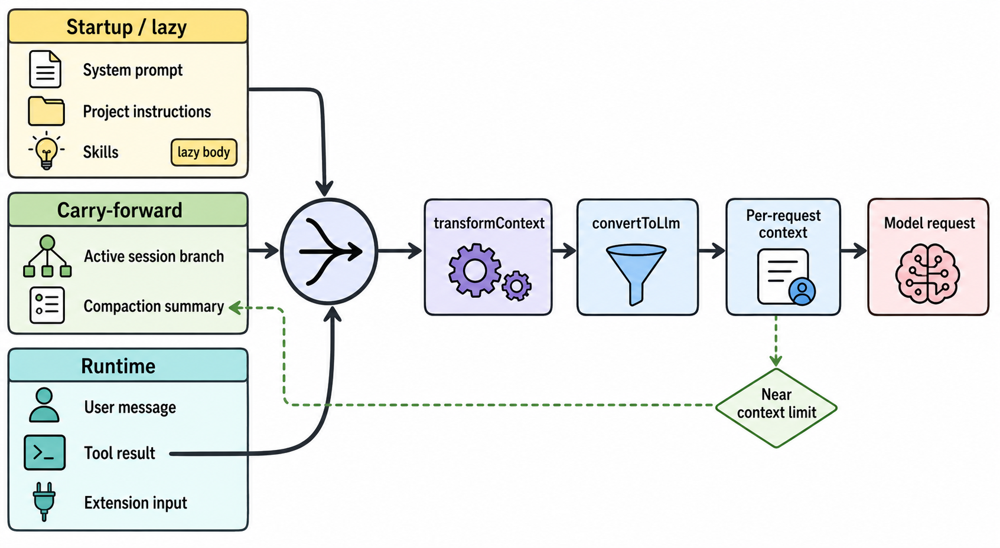

# 04 上下文、记忆与压缩

> 图 3（gpt-image-2 读者插图）：startup/lazy、carry-forward 和 runtime 三类来源先汇入同一入口，再依次经过 `transformContext -> convertToLlm -> Per-request context -> Model request`；compaction 是虚线条件回路。第一版因错误画出 tool result 直达 model 而被拒绝，本图为修正并复审后的 v2。图像的 prompt、output hash 与语义审查见[生成图 metadata](../diagrams/generated/metadata.json)；context 数据流来自[Harness IR](../hir.json)和下列 Evidence IDs。Evidence: `S-001`, `S-002`, `S-004`, `S-005`, `S-008`, `S-009`, `R-001`, `R-002`, `R-004`, `X-003`。

## Context 来源

| 来源 | 生命周期 | 进入方式 |
|---|---|---|
| 默认/自定义 system prompt | startup + refresh | `buildSystemPrompt()` |
| AGENTS.md / CLAUDE.md | startup/reload | `<project_instructions>`；不受 project trust 保护，除非禁用 context files |
| `.pi/SYSTEM.md` / append prompt | startup/reload | 受 project trust 保护 |
| Skills metadata | startup/reload | 有 read tool 时列在 system prompt |
| `/skill:name` full body | lazy, per invocation | 展开成 user-side invocation text |
| Active session branch | carry-forward | `buildSessionContext()` |
| ToolResult | per tool turn | 追加 transcript 后进入下一模型请求 |
| Extension messages/system override | per turn | `before_agent_start` |
| Context hook transform | per provider request | `transformContext` 后再 `convertToLlm` |

[C: C-003] 的置信度为 medium，因为本轮没有部署 request proxy 做全部 source 的差分；真实场景只验证了最小路径和 toolResult 回填。

## Durable memory

Pi 没有独立向量 memory 层。核心 durable memory 是 session tree：message、model/thinking change、custom entry、compaction、branch summary 等都在 JSONL 中；active branch 通过 parent chain 与 leaf 计算。workspace 文件是另一条独立持久层，不会自动与 session rollback 保持一致。[S: S-008]

## Compaction

Coding Agent 分两类：

- **Overflow**：错误或 usage 超过当前 model window；删除 live context 中的 error，生成 summary，最多 compact-and-retry 一次。
- **Threshold**：接近窗口时压缩，但不自动重新回答已完成的 assistant turn。

Compaction entry 保存 summary、`firstKeptEntryId`、`tokensBefore` 和 details；随后重建 active context。[S: S-009] [X: X-003]

新 `AgentHarness.compact()` 已有手动结构操作和 compaction helpers，但 auto-compaction decision 尚未实现。[D: D-008]
