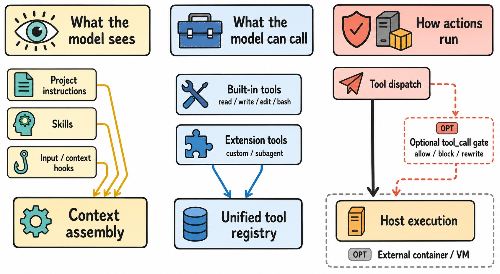

# 05 模型、工具与扩展

> 图 4（gpt-image-2 读者插图）：三列分别回答模型看到什么、能调用什么、action 如何运行；默认 host path 与可选 gate/container 明确分离。可复现的[叙事 SVG](../diagrams/narrative/pi-extension-injection.svg)和[技术 extension view](../diagrams/tool-extension-surface.svg)保留完整 evidence 映射。Evidence: `D-002`, `D-004`, `D-007`, `S-001`, `S-002`, `S-003`, `S-007`, `S-015`, `S-017`, `R-002`。

## Model boundary

`pi-ai` 的运行时单位是 Provider：id/name/base URL、auth、model catalog、`stream` 和 `streamSimple`。`ModelsImpl` 在每次请求前解析 provider auth，合并 base URL/header/env，再把 model/context 分派给拥有该 model 的 provider。[S: S-012]

本轮用隔离 `models.json` 注册 `siflow/qwen3.6-35ba3b`：`--list-models` 成功，随后真实 text/read 场景都通过相同 provider abstraction。[R: R-005, R-001, R-002]

## Tool registry

`AgentSession._refreshToolRegistry()` 合并：

- built-in tool definitions；
- extension `registerTool()`；
- SDK custom tools；
- CLI/settings allowlist 与 denylist。

extension/custom tool 同名时按 load/order 进入最终 map；resource loader 会产生 conflict diagnostic，但机制仍允许扩展覆盖/替换能力。[S: S-003]

## Hook 注入点

- `input`：handled 或 transform；
- `before_agent_start`：加 custom messages 或替换当轮 system prompt；
- `context`：模型边界前变换消息；
- `tool_call`：validated args 后、execute 前，可 block；
- `tool_result`：execute 后，可改 content/details/error；
- provider request/payload/response hooks；
- session switch/fork/compact/tree lifecycle hooks。

这些 hooks 是控制面，不是被隔离的 plugin VM；extension TypeScript 与主进程同权限。[D: D-002]

## 不内置的协议

核心明确不内置 MCP。要么把 CLI + README 暴露成 skill，要么 extension 自行注册 MCP tool。因而 HIR 中没有把 MCPServer 画成现存核心组件。[D: D-004]
