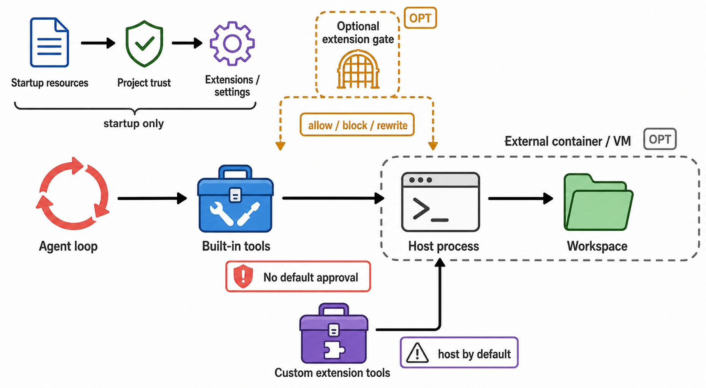

# 06 权限、Sandbox 与 Workspace

> 图 5（gpt-image-2 读者插图）：中心实线是默认 side-effect path；startup-only project trust、可选 extension gate、外部 container/VM 和 custom-tool host path 被空间分离，不能读成全局强制审批。图像的 prompt、output hash 与语义审查见[生成图 metadata](../diagrams/generated/metadata.json)；边界结论来自[Harness IR](../hir.json)和下列 Evidence IDs。Evidence: `D-002`, `D-004`, `D-007`, `S-003`, `S-006`, `S-007`, `S-017`, `R-002`, `X-001`。

## 三个容易混淆的边界

1. **Project trust**：启动资源加载 gate。它防止仓库在未确认时加载 `.pi/settings.json`、extensions、skills、SYSTEM 等。它不限制模型之后调用 read/bash/write。[C: C-006]
2. **Tool hook**：可选 application policy。extension 可在 `tool_call` 返回 block；`protected-paths.ts` 是示例，不是默认策略。[C: C-017]
3. **Sandbox**：OS/container/VM 边界。Pi 默认没有；需要 whole-process Docker/OpenShell，或用 Gondolin extension 路由 built-in tools。[C: C-005]

## 默认 side-effect path

内置 bash 在 cwd 启动 shell，默认继承进程环境；timeout 参数可选且无默认值。Unix 使用 detached process group，abort/timeout 会 kill tree。extension 代码、package install、language server 与 shell 子进程都处于同一用户权限边界。[C: C-007]

## 外部隔离的绕行风险

Gondolin example 覆盖内置 tools 与 `!` command，但其他 custom extension tools 仍在 host，除非自己 delegate。Whole-process container 更完整，但 bind-mounted workspace 仍会写回 host；挂载 host agent dir 还会暴露 sessions/settings/auth。[D: D-007]

## 本轮没有做什么

没有触发 bash/write/edit，也没有声称验证了 deny 后“零副作用”。这是安全限制，不是系统具备 deny gate 的证据。要验证部署安全，需要在 disposable VM 中跑 tool/extension/`!`/subagent 的 side-effect matrix。
