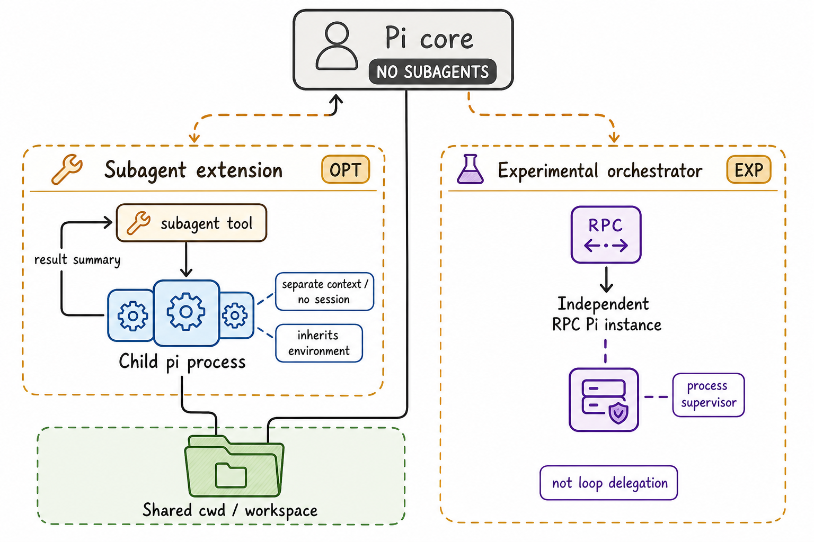

# 07 Subagent 与 Delegation

> 图 6（gpt-image-2 读者插图）：核心默认无 subagent；可选 subagent extension 与 experimental orchestrator 是两条不同条件路径。Child 隔离 context/process 但共享 cwd/workspace，orchestrator 不是 loop delegation。图像的 prompt、output hash 与语义审查见[生成图 metadata](../diagrams/generated/metadata.json)；topology 结论来自[Harness IR](../hir.json)和下列 Evidence IDs。Evidence: `D-004`, `D-006`, `D-010`, `S-015`, `S-016`。

## 默认核心

Coding Agent README 明确写出 “No sub-agents”。默认 tool registry 不会自动出现 delegation，也没有父子 context/session 协议。[C: C-013]

## 示例 extension

`examples/extensions/subagent` 注册一个 `subagent` tool：

- single、parallel（最多 8 task、并发 4）和 chain；
- 每个 child 为独立 `pi --mode json -p --no-session` 进程；
- system prompt 写入 mode `0600` 临时文件并 append；
- child 默认 cwd 与 parent 相同，可覆盖；
- 解析 child JSON events，聚合 usage/tool calls/final output；
- abort 先 SIGTERM，5 秒后尝试 SIGKILL；
- parallel 返回每 task 最多 50KB 到 parent context，完整值留在 details。

因此隔离的是 **context/process**，不是 workspace 或权限。child 默认继承进程环境，工具能力由 agent definition 的 model/tools 字段控制。[S: S-015]

Project-local agent prompt 是 repo-controlled；interactive mode 可确认，但 headless 退化路径本轮未验证。

## Experimental orchestrator

`OrchestratorSupervisor` 创建一个 RPC Pi child per instance，复用 events/UI request，持久化 instance/session metadata，并在意外退出时标 error/清理 Radius presence。restart recovery 只是把原 online/starting 记录标 stopped，没有恢复 in-flight child。[C: C-018]

它更像 multi-session process supervisor，不是 agent loop 中的 parent/child delegation primitive。
