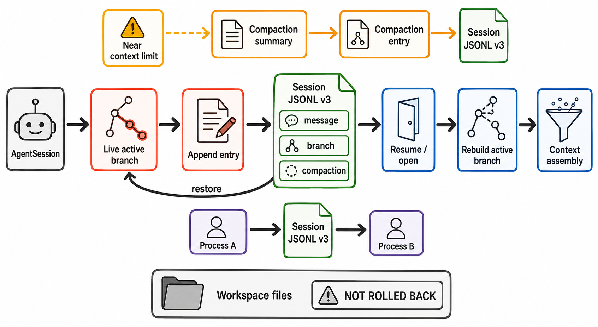

# 08 Session、持久化与恢复

> 图 7（gpt-image-2 读者插图）：主轴展示 live branch 的 append、JSONL persistence、resume 和 context rebuild；compaction 是条件路径，workspace 明确不随 session branch 回滚。图像的 prompt、output hash 与语义审查见[生成图 metadata](../diagrams/generated/metadata.json)；持久化关系来自[Harness IR](../hir.json)和下列 Evidence IDs。`R-SCENARIO-003/004` 观察到 create/persist/restore；compaction/retry 来自定向 tests。Evidence: `S-008`, `S-009`, `S-010`, `S-014`, `R-003`, `R-004`, `X-003`。

## JSONL v3

首行是 session header：version、session id、timestamp、cwd、可选 parentSession。后续每个 entry 有短 id、parentId、timestamp；append 作为 current leaf 的 child 并推进 leaf。类型包括 message、model/thinking/tool changes、custom、compaction、branch summary、label、session info 等。[S: S-008]

读取时 Pi 流式解析 JSONL，单个 malformed line 会被跳过；非空文件如果最终没有合法 Pi header 则拒绝打开。v1/v2 会迁移到 v3并重写文件。中间 entry 损坏是否造成可接受但错误的 branch 仍是开放风险。

| 状态 | Live owner | Durable 表示 | Resume/fork 行为 | 不随 session 恢复的内容 |
|---|---|---|---|---|
| Active conversation branch | `AgentSession` + `SessionManager` current leaf | JSONL entry 的 `id/parentId` tree 与 leaf | resume 选择 active leaf；branch navigation/fork 选择或复制 path | workspace 文件、外部进程、网络服务状态 |
| Model/thinking choice | session runtime | model/thinking change entries | `buildSessionContext()` 重放到 active path 的有效配置 | provider 端连接/stream |
| Message/tool transcript | low-level Agent context | message entries，包括 assistant toolUse 与 toolResult | 重建为下一 request 的 carry-forward context | tool 已造成的副作用不会重放或撤销 |
| Compaction | Coding Agent orchestration | summary、`firstKeptEntryId`、`tokensBefore`、details | active context 用 summary + kept suffix 重建 | 被 summary 丢失的细节不能从有效 context 自动恢复 |
| Retry/error | `AgentSession` recovery state | provider error 可留 session；live context 可移除 | reopen 可看到 durable entry，但不会恢复中断的 provider stream | backoff timer、in-flight HTTP stream |
| Workspace | OS/filesystem | Pi session 外部的目录现实状态 | resume/fork 继续看到当前磁盘 | 没有 conversation leaf 对应的自动 snapshot/rollback |

## Resume 与 fork

- Resume/open：加载 entries、迁移、重建 index/leaf，再 `buildSessionContext()`。
- Branch navigation：移动 leaf，可对离开的 branch 生成 summary。
- Fork：新 header 指向 `parentSession`，复制 selected history 或 active path，并为目标 cwd 重建 runtime services。

## 跨进程实验

进程 A 使用 `session-id=analysis-resume-001` 收到“记住 `PI_RESUME_2718`”，返回 ACK 并退出。进程 B 只要求返回前一进程 token，成功返回 `PI_RESUME_2718`。raw session copy 位于 `traces/raw/R-004-session-state.jsonl`，normalized traces 不含 prompt/thinking。[R: R-003, R-004]

## Recovery 分层

- provider retryable error：指数退避、maxRetries 有界；error 留 durable session，从 live context 移除。
- context overflow：compaction path，不进入普通 retry；最多一次 compact-and-retry。
- length-truncated tool call：不执行，返回错误让模型重发。
- abort：low-level signal 传入 model/tool；Coding Agent 还负责清理 tracked detached children。
- 新 AgentHarness：半持久恢复尚在设计；provider stream 不可恢复，unfinished tool 是否可重试需要 idempotency 声明。[C: C-020]
