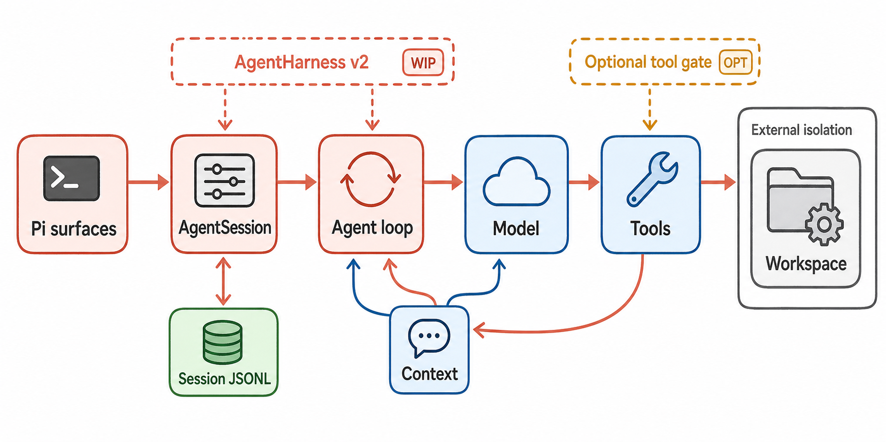

# Pi Agent Harness 架构恢复报告

分析对象：`earendil-works/pi` tag `v0.80.7`，commit `818d67457cdd6b60bce6b121d16b23141c252dd8`。

本报告不是文件树摘要。结论来自固定版本源码、官方仓库文档、4 个真实 SiFlow 场景和 3 组 faux-provider 定向测试，并通过 Harness Analysis validator 做了 claims/evidence/HIR 的交叉校验。首次遇到内部类型、事件名或 provider/session 术语时，可查[全局术语表](16-glossary.md)。

## 一句话结论

Pi 是一个“薄核心、强扩展、外部隔离”的 agent harness：`pi-ai` 统一 provider，`agent-core` 提供通用模型/工具循环，Coding Agent 的 `AgentSession` 负责当前产品级 compaction、retry、session、资源和 extension 编排；新的通用 `AgentHarness` 正在把这些职责下沉，但在 `v0.80.7` 还没有替代 `AgentSession`。[D: D-001, D-003, D-008] [S: S-001, S-002, S-011]

> 图 1（gpt-image-2 读者插图）：六步主轴优先解释 Pi 的当前运行路径；迁移、可选 gate、durable state 和外部隔离被降为支路。图像经过标签、箭头、可选性和边界语义审查；它不是证据真值。图像的 prompt、output hash 与语义审查见[生成图 metadata](../diagrams/generated/metadata.json)；结构事实来自[Harness IR](../hir.json)和下列 Evidence IDs。Evidence: `S-001`, `S-002`, `S-008`, `S-012`, `S-013`, `S-017`, `R-001`, `R-002`, `R-004`, `X-002`, `X-003`。

## 阅读框架

先阅读[设计空间与贯穿案例](00-design-space-and-running-example.md)。它用六个 recurring design questions 解释 Pi 的选择，并以真实 `read -> toolResult -> second model call` trace 贯穿后续章节。Subsystem 章节提供机制细节；claim index、HIR 和技术投影负责审计，不要求正文图同时承担全部证据浏览任务。

## 核心发现

1. **真正的 canonical loop 很小。** `runAgentLoop()` 负责模型流、toolUse、toolResult、steering/follow-up 和退出。工具默认并行；任一工具声明 sequential 会让整批串行；结果仍按模型给出的 tool call 顺序进入 transcript。[C: C-002, C-015] [S: S-001] [X: X-001]

2. **当前有两层产品编排和一条迁移线。** `AgentSession` 是 Coding Agent 当前产品路径；新 `AgentHarness` 直接调用相同 low-level loop，通过 turn snapshot/save point 处理配置和持久化顺序，但 auto-compaction、retry、generic hooks、semi-durable recovery 与 Coding Agent migration 尚未完成。[C: C-010, C-016]

3. **安全边界不在进程内。** Project trust 只阻止未授权项目资源在启动时改变配置/extension；默认 read/write/edit/bash 与 extension 仍以 Pi 进程权限执行。逐工具确认、protected paths 和 subagent confirmation 都是可选 extension 策略，真正隔离依赖 container/VM/OS policy。[C: C-005, C-006, C-007, C-017]

4. **session 是 durable tree，不是平铺 chat log。** JSONL v3 entry 通过 `id/parentId` 形成树，leaf 选择 active branch；compaction summary 是一等 entry。跨两个独立 Pi 进程的恢复实验成功找回合成 token `PI_RESUME_2718`。[C: C-008, C-012] [R: R-003, R-004]

5. **核心不规定 MCP/subagent 工作流。** 默认没有 MCP 和 subagent；示例 subagent extension 通过独立 `pi --mode json --no-session` 进程获得隔离 context，但默认共享 cwd。另有 experimental orchestrator 管理独立 RPC Pi 实例，它不是默认 agent loop 的 delegation。[C: C-013, C-018]

6. **可观测性是事件流，不是完整 distributed trace。** JSON/RPC 暴露 message/tool/compaction/retry/settled 事件，足够重建一次运行；默认事件没有 traceId/spanId。仓库的 OTel/Sentry adapter 仍是 design notes。[C: C-014]

## 动态验证结果

| 场景 | 固定配置 | 区分性断言 | 结果与审计产物 | 能证明 | 不能推出 |
|---|---|---|---|---|---|
| `R-SCENARIO-001` | JSON mode；SiFlow；no session/tools/resources | 无工具时一次 provider turn 后是否进入 `agent_settled` | `PI_TEXT_OK`；`R-001-text-only.normalized.jsonl` | 最短真实模型生命周期至少成功一次 | 不证明 tool、session 或 retry 路径 |
| `R-SCENARIO-002` | JSON mode；只开放 `read`；合成 fixture | toolResult 是否进入第二次 provider request | read start/end、2 turns、`314159`；`R-002-read-tool.normalized.jsonl` | 真实 model -> tool -> context -> model 闭环 | 不证明 write/bash 的权限或隔离 |
| `R-SCENARIO-003/004` | 相同 session id；两个独立进程；无工具 | 新进程能否只靠 JSONL 恢复未重发 token | 恢复 `PI_RESUME_2718`；raw session copy + normalized events | 正常尾部写入后的跨进程恢复 | 不证明 corruption、半写入或 workspace rollback |
| `X-SCENARIO-001` | faux provider；agent-core tests | loop、并行/顺序、hooks、queue、length-stop 分支是否满足 contract | `39/39`；测试文件固定在 `X-001` | controller 分支在定向测试中通过 | 不评价真实模型选择工具的质量 |
| `X-SCENARIO-002` | faux provider；新 `AgentHarness` tests | snapshot/save point、pending writes 和 helper 是否按设计工作 | `61/61`；`X-002` | 迁移中 harness 的现有 contract | 不代表已替代 Coding Agent `AgentSession` |
| `X-SCENARIO-003` | Coding Agent recovery tests | overflow/threshold compaction、retry、context rebuild 是否分层 | `31/31`；`X-003` | 当前产品路径的定向恢复行为 | 不证明真实 crash、SIGINT 或超长模型场景 |

## 最高价值未知项

- 新 `AgentHarness` 与 Coding Agent `AgentSession` 的迁移/差分一致性尚未证明。
- Gondolin、Docker、OpenShell 和 extension custom tools 的完整 side-effect matrix 未运行。
- 损坏 JSONL、真实 SIGINT/tool timeout/进程 crash、半持久 turn recovery 未做故障注入。
- SiFlow 服务端仍默认输出 thinking，Pi 的 `reasoning:false` 没有关闭服务端 chat template；不影响循环验证，但属于 provider compatibility gap。

## 报告导航

- [设计空间与贯穿案例](00-design-space-and-running-example.md)
- [范围与方法](01-scope-method.md)
- [入口与生命周期](02-interfaces-lifecycle.md)
- [核心循环与编排](03-core-loop.md)
- [上下文、记忆与压缩](04-context-memory-compaction.md)
- [模型、工具与扩展](05-models-tools-extensions.md)
- [权限、sandbox 与 workspace](06-permissions-sandbox-workspace.md)
- [Subagent 与 delegation](07-subagents-delegation.md)
- [Session、持久化与恢复](08-sessions-persistence-recovery.md)
- [可观测性](09-observability.md)
- [设计决策与权衡](10-design-decisions.md)
- [运行实验](11-runtime-experiments.md)
- [失败模式与开放问题](12-failure-modes-open-questions.md)
- [覆盖与复现](13-coverage-reproducibility.md)
- [与 2604.14228 的质量对照](quality-comparison-2604.14228.md)
- [源码与 Claim 索引](14-source-claim-index.md)
- [全局术语表](16-glossary.md)
- [兼容 Claim index](claim-index.md)

结构化真值：[manifest](../manifest.json) · [HIR](../hir.json) · [claims](../evidence/claims.jsonl) · [evidence](../evidence/observations.jsonl) · [coverage](../evidence/coverage.json) · [scenarios](../scenarios/catalog.json)
